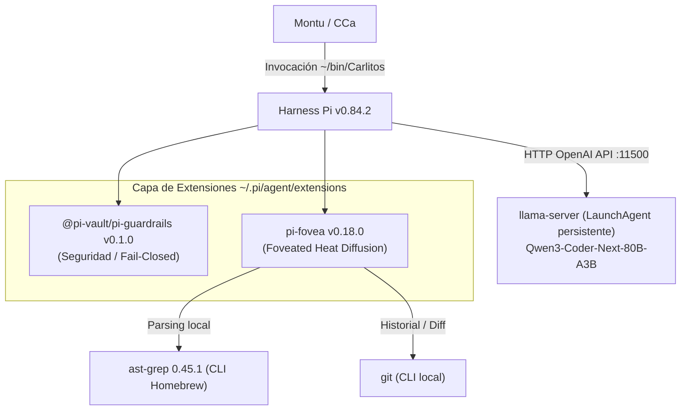

# EVALUACIÓN DE HARNESS AGÉNTICOS Y CAPAS DE CONTEXTO PARA CARLITOS
**Fecha:** 2026-08-17  
**Autor:** Antigravity (Documentación Técnica MS)  
**Estado:** Veredicto Aprobado / Implementado en Mac Studio  
**Alineación:** Metodología Sinérgica v3.0 (Harness Engineering)  

---

## Contexto y objetivo

El objetivo central de esta investigación técnica e implementación fue optimizar a **Carlitos** (agente de coding local operando sobre `llama-server` con el modelo `qwen3-coder-next-80b-a3b` en el Mac Studio M2 Max), buscando **reducir drásticamente el volumen de contexto inyectado por tarea**. Esta reducción es la condición habilitadora para, en una fase posterior, explorar el swap hacia modelos locales más chicos y rápidos (ej. 7B–14B o Devstral Small) sin degradar la calidad y precisión de la generación de código.

### Métrica cardinal: "Tokens hasta resultado correcto"
Se estableció como principio que la métrica de éxito relevante no es la velocidad de generación bruta (tokens por segundo), sino los **tokens consumidos y turnos requeridos hasta alcanzar un resultado correcto**. La justificación empírica se sustenta en dos hallazgos clave:
1. **Benchmark de Databricks sobre Pi:** Pi supera a otros harness y configuraciones no por generar texto a mayor velocidad de reloj, sino porque requiere aproximadamente **~3x menos contexto por turno y menos ejecuciones/reintentos** para resolver la tarea completa.
2. **Dinámica de razonamiento en modelos avanzados (ej. Qwen3.8-Max):** Reducir artificialmente el parámetro `reasoning_effort` para obtener respuestas rápidas incrementa el tiempo y consumo total de tokens debido a los reintentos necesarios tras fallas en tareas insuficientemente analizadas en el primer pase.

---

## Herramientas evaluadas y veredicto

A continuación se detalla la evaluación técnica de las herramientas, harness y capas de contexto analizadas durante la sesión:

| Herramienta | Descripción en una línea | Veredicto | Motivo / Criterio |
|---|---|---|---|
| **Pi** (`@earendil-works/pi-coding-agent`, repo `earendil-works/pi`; autores: Mario Zechner y Armin Ronacher) | Harness de coding agent minimalista y extensible en TypeScript. | **Adoptado (en producción)** | Operativo en Mac Studio, actualizado el 2026-08-18 de v0.73.1 (paquete viejo `@mariozechner/pi-coding-agent`) a v0.84.2 (paquete actual `@earendil-works/pi-coding-agent`) — ver LOG_CAMBIOS_2026.md. Arquitectura limpia, soporte nativo de extensiones y bajo overhead de contexto. |
| **pi-fovea** (`monotykamary`) | Extensión para Pi de navegación de contexto vía heat diffusion sobre grafo AST local. | **Adoptado con uso selectivo** (act. 2026-08-18) | Autocontenida, sin servicios externos, CERO llamadas de red, usa `ast-grep` y `git` locales. Benchmark formal de 15 tareas sobre OptiFierro-V2 mostró ventaja real solo en tareas multi-archivo; neutra en tareas de archivo único. Ver sección "Decisión final y arquitectura adoptada". |
| **@pi-vault/pi-guardrails** | Extensión de guardrails de seguridad y control de ejecución para Pi. | **Adoptado** | Protección perimetral activa: bloqueo de secretos, comandos destructivos y modo ask por defecto. |
| **Tau** | Harness agéntico alternativo para flujos de desarrollo. | **Descartado** | Pi ya cubre el 100% de los requerimientos en producción con menor complejidad y sin justificación para migración. |
| **CodeGraph** | Motor de indexación y grafo de dependencias para bases de código. | **Descartado (stand-alone)** | Requiere infraestructura pesada externa / servicios adicionales no autocontenidos. |
| **Graphify** | Herramienta de extracción de relaciones y grafos de código. | **Descartado (stand-alone)** | Alta sobrecarga operativa frente a soluciones integradas en el harness. |
| **pi-codegraph** | Variante / wrapper de grafo de código adaptado para Pi. | **Plan B (Respaldo)** | Candidato de fallback en caso de que pi-fovea no cumpla con los objetivos de reducción de tokens en el benchmark formal. |
| **pi-graphify** | Variante / integración de Graphify como extensión para Pi. | **Plan B (Respaldo)** | Candidato secundario de fallback si se requiere un motor de grafo alternativo. |
| **DeepSeek Harness (dsh)** | Harness agéntico especializado del ecosistema DeepSeek. | **Watchlist (En observación)** | Ecosistema inmaduro, alto acoplamiento y falta de validación independiente con modelos chicos. |

### Criterios de reactivación para DeepSeek Harness (dsh)
DeepSeek Harness permanece en **Watchlist**. Para reconsiderar su evaluación o adopción en el stack de Montuschi Consultores, deben cumplirse la totalidad de los siguientes criterios:
1. **Release estable:** Publicación de una versión estable con compromiso formal y declarado de retrocompatibilidad.
2. **Casos de uso externos validados:** Documentación de casos de uso comunitarios exitosos operando con modelos locales pequeños (7B–14B / MoE ligeros).
3. **Comunidad activa:** Fusión de Pull Requests relevantes de desarrolladores terceros (evidencia de gobernanza abierta).
4. **Consolidación de plugins:** Consolidación de extensiones de grafo equivalentes (`dsh-fovea` u homólogos).
5. **Análisis independiente de benchmarks:** Existencia de análisis de terceros que desacople y aísle el impacto real del harness vs el rendimiento intrínseco del modelo evaluado en sus métricas públicas.

---

## Decisión final y arquitectura adoptada

Se ratifica la siguiente arquitectura modular para el agente local **Carlitos** en el Mac Studio:

1. **Harness:** **Pi** se mantiene como el harness estándar en producción, actualizado el 2026-08-18 a v0.84.2 (paquete `@earendil-works/pi-coding-agent`) tras detectarse que la v0.73.1 instalada (paquete viejo `@mariozechner/pi-coding-agent`) no exponía `ctx.isProjectTrusted()`, método requerido por extensiones escritas contra la API nueva — ver LOG_CAMBIOS_2026.md 2026-08-18 para el detalle del bug y la reinstalación.
2. **Capa de Grafo / Contexto:** **`pi-fovea`** (v0.18.0) seleccionada como la solución principal por ser la **única opción 100% autocontenida** (no requiere Docker, bases de grafos como Memgraph ni servidores MCP externos). El benchmark formal (2026-08-18, 15 tareas reales de solo lectura sobre OptiFierro-V2) reemplazó la adopción sin condiciones inicial por una **política de uso selectivo**: tiempo de ejecución prácticamente igual con y sin fovea (56.7s vs 58.7s), y comparando solo tokens frescos (input+output, sin contar `cacheRead` reutilizado) el costo es prácticamente idéntico (diferencia de 3%). La ventaja real de fovea aparece específicamente en tareas que cruzan múltiples archivos (búsqueda de patrones, trazado de referencias cruzadas, estructura de directorio completo), con ahorros de tokens de hasta 3-4x en esos casos frente a tareas acotadas a un solo archivo, donde fovea es neutro o incluso agrega overhead sin beneficio claro. Directriz operativa: activar fovea para tareas multi-archivo, dejarlo opcional/apagado para tareas de archivo único. Esta hipótesis se apoya en solo 3 casos de una muestra de 15 — pendiente de validación con muestra mayor (ver Backlog técnico derivado) antes de convertirla en regla dura del harness.
3. **Plan B:** `pi-codegraph` y `pi-graphify` quedan archivados como contingencia técnica si una muestra mayor revirtiera la ventaja observada de `pi-fovea` en tareas multi-archivo.
4. **Capa de Seguridad:** **`@pi-vault/pi-guardrails`** (v0.1.0) instalada y activa de manera independiente de las herramientas de contexto, proveyendo aislamiento perimetral estricto.

---

## Principios metodológicos establecidos

Durante este ciclo de investigación se fijaron tres reglas metodológicas no-negociables:

1. **Auditoría de seguridad SIEMPRE antes que benchmark de rendimiento:**  
   Nunca se ejecutan pruebas de carga ni integración de extensiones sin antes auditar exhaustivamente el código fuente (`src/` y `dist/`) para garantizar ausencia de exfiltración de red, llamadas a APIs externas no autorizadas o vulnerabilidades de ejecución.
2. **Aislamiento de variables (Modelo vs. Contexto):**  
   Al evaluar optimizaciones no se deben mezclar variables simultáneamente. El protocolo exige:
   - *Paso 1:* Confirmar y medir la reducción real de tokens con el modelo actual (`Qwen3-Coder-Next`) activando `pi-fovea`.
   - *Paso 2:* Una vez validado el contexto curado, usar ese contexto como **constante** para comparar el modelo actual contra candidatos más livianos (ej. 7B–14B).
3. **Escepticismo empírico frente al marketing:**  
   Tratar con riguroso escepticismo métricas de estrellas de GitHub, claims de fabricantes o benchmarks sintéticos sin correlación externa verificada de manera independiente.

---

## Nota sobre Qwen3.8-Max (Uso exclusivo para QRO, no para Carlitos)

Se documenta la caracterización del modelo **Qwen3.8-Max**, disponible a través de Qwen Desktop (rol QRO en Mac Studio):

- **Arquitectura:** MoE de 2.4T parámetros totales, ~95B activos por token, ventana de contexto nativa de 1M tokens, con control de `reasoning_effort`.
- **Fortalezas comprobadas:** Extraordinario desempeño en razonamiento e investigación documental (PaperBench: 93.0, IFBench: 82.8, OSWorld-Verified: 86.1).
- **Debilidades relativas:** Desempeño comparativo inferior en SWE-bench y tareas de coding frente a modelos especializados.
- **Directriz de uso en MS:**
  - **Exclusivo para QRO:** Asignado a tareas de *deep research*, revisión crítica adversarial (red-team arquitectónico), scraping masivo y análisis de corpus extensos. **No se utiliza para coding ni para el rol de Carlitos.**
  - **Parámetros recomendados:** Configurar `reasoning_effort` en niveles **alto o xhigh** para investigación profunda (la latencia es irrelevante en flujos asíncronos manuales de análisis) y aprovechar `preserve_thinking` entre rondas sucesivas de scoping.

---

## Política "fovea selectivo" — implementación formalizada (2026-08-19)

Cierra `BACKLOG-FOVEA-MUESTRA-MAYOR` en su parte de implementación (la validación
estadística con muestra mayor queda como ítem aparte, ver backlog). Se investigó
el mecanismo real de toggle de pi-fovea antes de implementar nada (RCA primero):

**Hallazgo de arquitectura:** pi-fovea expone dos superficies de control distintas:

1. **4 tools standalone** (`fovea_sketch`, `fovea_focus`, `fovea_dwell`,
   `fovea_impact`) — el modelo las invoca explícitamente. Se pueden excluir por
   invocación con la flag nativa de Pi `--exclude-tools`, sin tocar ningún
   archivo de config ni el core de la extensión. **Este es el punto de control
   real usado para la selectividad.**
2. **Hook de "grep augment mode"** — intercepta resultados de la tool nativa
   `grep` en queries tipo-símbolo y les agrega una sección de grafo. Se
   controla vía `tools.grepMode` (`off`/`replace`/`augment`, default
   `augment`) en `~/.pi/agent/fovea.json` (global) o `<repo>/.pi/fovea.json`
   (por proyecto) — **no tiene override por CLI ni por variable de entorno**,
   solo por archivo. No se implementó toggle por invocación para este hook:
   el benchmark del 2026-08-18 lo tuvo activo en las 15 tareas (incluidas las
   12 de archivo único) y no mostró perjuicio, así que no se consideró
   necesario resolverlo en esta fase. Ver `BACKLOG-FOVEA-GREPMODE`.

**Implementación:** `~/bin/Carlitos` (Mac Studio) rediseñado con default
**fovea OFF** (excluye las 4 tools) y flag explícita `--fovea` como primer
argumento para activarlas en tareas multi-archivo. Decisión de diseño:
activación **declarativa** (el operador decide), no heurística automática por
clasificación de la tarea — honesto dado que la política se sostiene sobre
apenas 3 casos de evidencia (ver `BACKLOG-FOVEA-MUESTRA-MAYOR`); una
heurística automática necesitaría más muestra para no ser una suposición
disfrazada de regla.

Validado con 4 pruebas antes de reemplazar el wrapper en producción:
tools ausentes del set del modelo sin `--fovea`, presentes con `--fovea`,
timing normal, y una tarea de código real sin regresión. Copia versionada del
wrapper en `harness/carlitos/wrapper_carlitos.sh` (`~/bin` no está bajo git,
ver hallazgo en LOG_CAMBIOS_2026.md 2026-08-19).

**Hallazgos colaterales durante la implementación** (no estaban en el alcance
original, se documentan porque el protocolo del ecosistema lo exige):
- Reproducido en vivo el bug de stdin colgado en invocaciones headless de Pi
  (ya documentado el 2026-08-18) — se agregó blindaje `< /dev/null`
  condicionado a modo one-shot en el wrapper (nunca en modo interactivo, para
  no romper el TUI).
- `set -u` + array bash vacío revienta en bash 3.2 (el bash de sistema de
  macOS) con "unbound variable" — no reproduce en bash 4+. El wrapper corregido
  usa `set -eo pipefail` sin `-u`, con la razón documentada inline.

## Backlog técnico derivado

1. **`BACKLOG-OLLAMA-CLEANUP`:** Limpieza del tag huérfano `carlitos:latest` en Ollama (18GB, remanente previo a la migración a llama-server, baja prioridad).
2. **`BACKLOG-FOVEA-BENCHMARK` [CERRADO 2026-08-18]:** Benchmark formal ejecutado sobre 15 tareas reales de solo lectura en OptiFierro-V2 (commit aa3145d593d68d9ac704934697295128043c4efd). Resultado real: pi-fovea NO mostró reducción de tokens pareja en todas las tareas, contrario a la expectativa inicial de este documento. Es neutro en tareas de un solo archivo y muestra ventaja real y grande (hasta 3-4x menos tokens frescos) en tareas multi-archivo. Política adoptada: uso selectivo, no adopción pareja como default — ver "Decisión final y arquitectura adoptada" y LOG_CAMBIOS_2026.md (2026-08-18) para el detalle completo, incluyendo el bug de compatibilidad de versión de Pi y el bug de script del primer intento de benchmark que se corrigieron antes de este resultado. Reporte completo en `docs/evidencia/REPORTE_BENCHMARK_FOVEA_OPTIFIERRO_2026-08-18.md`.
3. **`BACKLOG-FOVEA-MUESTRA-MAYOR`:** La hipótesis multi-archivo vs archivo único que sustenta la política de uso selectivo de pi-fovea se construyó sobre apenas 3 casos de una muestra de 15 tareas. Validar con una muestra mayor antes de convertirla en regla dura del harness (ej. activación automática de fovea por tipo de tarea detectado).
4. **`BACKLOG-MODEL-SWAP-BENCH`:** Benchmark de swap de modelo (Qwen3-Coder-Next vs 7B–14B / Devstral Small) manteniendo el contexto optimizado por pi-fovea como variable de control.
5. **`BACKLOG-CHATGPT-LUNA-EVAL`:** Exploración conceptual de ChatGPT / GPT-5.6 Luna (cuenta gratuita) como cuarto cerebro de apoyo para absorción de tareas analíticas sin consumo de cuota Anthropic.
6. **`BACKLOG-FOVEA-GREPMODE` [NUEVO 2026-08-19]:** El hook de "grep augment mode" de pi-fovea no tiene toggle por invocación (solo por archivo de config `fovea.json`, global o por proyecto). Si una futura muestra mayor (`BACKLOG-FOVEA-MUESTRA-MAYOR`) muestra que este hook sí tiene costo o interferencia en tareas de archivo único, evaluar escribir `<repo>/.pi/fovea.json` con `tools.grepMode: "off"` desde el wrapper antes de invocar Pi en modo fovea-OFF. No implementado ahora porque el benchmark del 2026-08-18 no mostró perjuicio con el hook activo.
