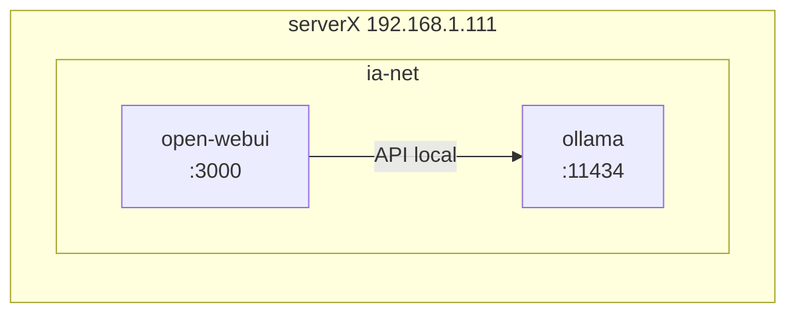
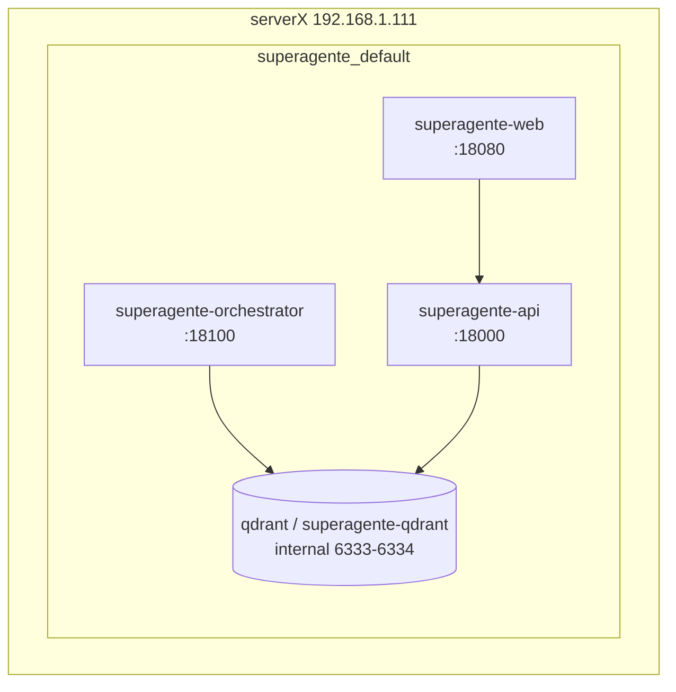
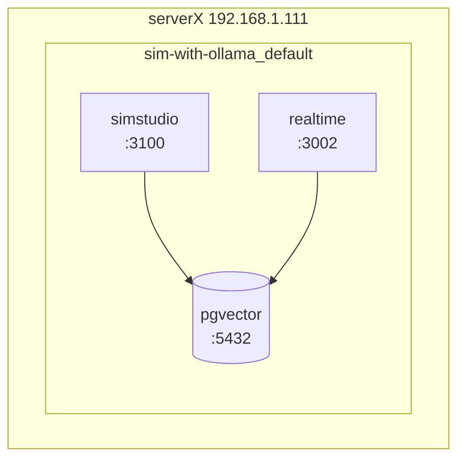
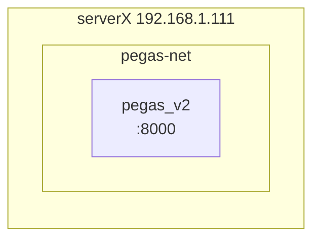
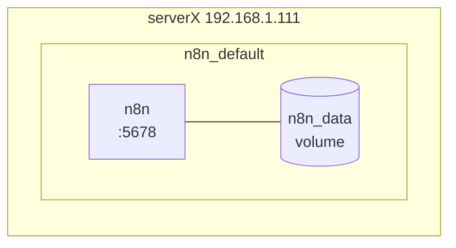
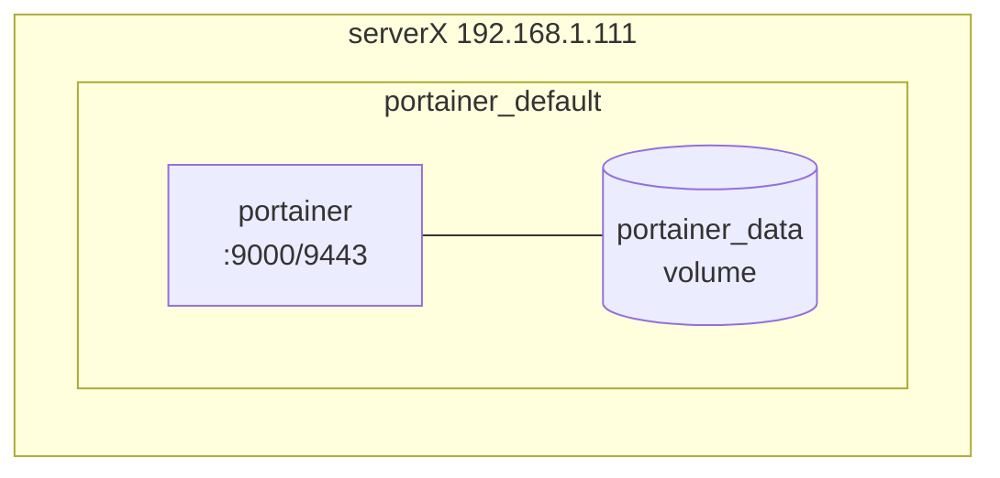

# DOCUMENTO TÉCNICO MAESTRO

## Mi Infraestructura TI

**Fecha de actualización:** 2 de mayo de 2026

---

# 1. Identidad y Direccionamiento Interno

## Servidores Principales

### serverX

- IP fija LAN: **192.168.1.111**
- Acceso SSH: `ssh x@192.168.1.111`
- Rol: Nodo principal de cómputo (IA + Procesos Nativos) **y** estación desktop diaria (KDE Plasma activo).
- Sistema Operativo: **Ubuntu Server 24.04.4 LTS + KDE Plasma**

### serveri3

- IP fija LAN: **192.168.1.211**
- Acceso SSH: `ssh i3@192.168.1.211`
- Rol: Gateway único hacia Internet (**Cloudflare Tunnel**), **Pi-hole**, Web pública y servicios 24/7.
- Sistema Operativo: **Ubuntu 24.04.4 LTS**

Arquitectura de entrada:

```
Internet → Cloudflare → serveri3 → (servicios locales en i3) + (derivación interna hacia serverX cuando aplica)
```

**Regla de seguridad:** serverX **NO** expone puertos directamente a Internet (el acceso público ocurre por Cloudflare vía serveri3).

---

# 2. SERVERX – Nodo de Cómputo Intensivo y Desarrollo

## 2.1 Rol Estratégico

- Ollama (LLMs locales)
- Pegas V2
- Visual-Voice
- Portainer
- Desarrollo continuo
- Uso como workstation diaria
- NoMachine Server (Escritorio Remoto KDE virtual desde MacBook)
- CutX (stem separation de audio)
## Cliente RDP — serverX (KDE Plasma)
- Herramienta activa: KRDC (cliente RDP nativo KDE)
- Instalación: sudo apt install krdc
- Reemplaza a: Remmina (deprecado en este entorno)
- Motivo: Remmina crasheaba al redimensionar ventana (conflicto GTK/KWin).
  Fix GDK_BACKEND=x11 fue insuficiente.
- Destino principal: servidor TO (Windows 11 Pro, cliente Torres Ocaranza)
- Protocolo: RDP
- Fecha: 2026-03-20

**Nivel de criticidad:** Muy Alto

---

## 2.2 Infraestructura Docker (Estado Abril 2026)

### Contenedores Activos (resumen)

| Contenedor    | Imagen                  | Puerto Expuesto | Notas                                                                 |
| ------------- | ----------------------- | --------------- | --------------------------------------------------------------------- |
| ollama        | ollama/ollama:latest    | 11434           | GPU: runtime nvidia. Compose en /srv/ollama/.                         |
| pegas_v2      | pegas-v2:latest         | 8000            | Compose: /home/x/dev/pegas_v2/.                                       |
| visual-voice  | visual-voice:latest     | 8502            | Compose: /home/x/visual-voice/.                                       |
| portainer     | portainer-ce            | 9000 / 9443     | UI: 192.168.1.111:9000                                                |

> **Nota (act. 2026-04):** Reinstalación completa del sistema. Se han eliminado permanentemente: open-webui, n8n, sim-studio x3, superagenda x3, openclaw, geovictoria_api. El stack SuperAgente se encuentra temporalmente fuera de servicio.

> Nota: `OptiFierro V1` (contenedores `optifierro_app` y `optifierro_db`) ha sido deprecado y eliminado de la infraestructura Docker.

---

## 2.3 Gestión Docker — Portainer Multi-Host (act. 2026-04-04)

### Portainer (serverX — host local)
- **UI:** http://**192.168.1.111**:9000
- **Usuario admin:** `admin` / `Montu7689!Admin`
- **Versión:** Community Edition 2.33.5 LTS
- **Environment local "serverX":** registrado vía socket `/var/run/docker.sock`

### Portainer Agent (serveri3)
- **Contenedor:** `portainer_agent`
- **Imagen:** `portainer/agent:latest` (v2.39.1)
- **Puerto:** `9001` (HTTPS, TLSSkipVerify=true)
- **Compose:** `/srv/portainer-agent/docker-compose.yml`
- **Environment registrado en Portainer como:** "serveri3" (Id=2, Status=Up)
- **URL:** `tcp://192.168.1.211:9001`
- **Fecha instalación:** 2026-04-04

### Resultado
- Ambos hosts gestionables desde UI web unificada en http://**192.168.1.111**:9000
- Control centralizado (On/Off) de contenedores sin CLI desde cualquier navegador.

---

## 2.4 Redes Docker Activas

- ai-net
- ia-net
- superagente_default
- sim-with-ollama_default
- pegas-net
- n8n_default
- portainer_default
- openwebui_knowledge_default
- web_default
- cutx-bridge (creada para CutX, driver bridge con NAT, permite salida a internet desde el contenedor)

> Nota: La red `optifierro_optifierro-net` fue eliminada tras la migración a V2.

---

## 2.5 Volúmenes Persistentes

- n8n_data
- ollama_models
- open-webui
- openwebui_data
- portainer_portainer_data
- qdrant_data
- sim-with-ollama_postgres_data
- superagente_qdrant_data

Persistencia desacoplada de contenedores.

---

## 2.6 Matriz de puertos (publicados vs internos)

> Objetivo: dejar explícito qué está “hacia LAN” y qué está “solo dentro de Docker / localhost”.

### 2.6.1 Servicios Nativos en Host (No-Docker)
| Servicio | Proceso | Puerto Publicado (LAN) | Vectores de Acceso |
| :--- | :--- | :--- | :--- |
| OptiFierro V2 | `streamlit run app.py` | `0.0.0.0:8503` | **Público:** `https://optifierro.montuschi.cl`<br>**VPN:** `http://10.212.134.171:8503` |
| NoMachine Server | `nxserver` (systemd) | `0.0.0.0:4000` | **LAN only:** `192.168.1.111:4000` — NO expuesto a internet |

### 2.6.2 Puertos Docker publicados en serverX (LAN)

| Servicio      | Contenedor    | Publicación           |
| ------------- | ------------- | --------------------- |
| Ollama        | ollama        | `0.0.0.0:11434→11434` |
| Pegas V2      | pegas_v2      | `0.0.0.0:8000→8000`   |
| Visual-Voice  | visual-voice  | `0.0.0.0:8502→8000`   |
| Portainer     | portainer     | `0.0.0.0:9000→9000`   |

> Nota: Los servicios de OptiFierro V1 (App, DB, Adminer) en puertos `8000`, `8501`, `5433` y `8085` están deprecados.

---

## 2.7 Diagramas Docker por proyecto/red (Mermaid)

### 2.7.1 Stack IA (Open WebUI ↔ Ollama) — `ia-net`



### 2.7.2 Stack SuperAgente — `superagente_default`


### 2.7.3 Stack SIM — `sim-with-ollama_default`


> Nota: El diagrama para `Stack OptiFierro` fue eliminado por migración a V2 (No-Docker).

### 2.7.4 Stack Pegas — `pegas-net`



### 2.7.5 n8n — `n8n_default`



### 2.7.6 Portainer — `portainer_default`



---

## 2.8 Inventario de Archivos OptiFierro V2
| Archivo | Descripción |
| :--- | :--- |
| `app.py` | Orquestador y Login. |
| `seccion_1.py` a `seccion_8.py` | Módulos de cada pestaña. |
| `data_mock.py` | Generador de datos. |
| `utils.py` | Estilos y funciones NLP. |
| `Maestro_operadores_maquinas.xlsx` | Fuente de datos maestros de planta. |

---

## 2.9 NoMachine Server (Acceso Escritorio Remoto)
- **Versión:** 8.20.1
- **Puerto:** 4000 (protocolo NX)
- **Servicio systemd:** `nxserver.service` (enabled, arranca con el sistema)
- **Config:** `/usr/NX/etc/node.cfg`
  - Parámetro clave: `DefaultDesktopCommand "/usr/bin/startplasma-x11"`
- **Uso:** Sesión KDE Plasma virtual desde MacBook. serverX corre headless; Mac actúa como motor gráfico.
- **Resolución activa:** 2560x1440 (configurado desde el cliente macOS)
- **Cliente macOS:** NoMachine 8.20.1 para macOS (instalado en MacBook Pro 13")
- **Acceso:** Solo LAN — `192.168.1.111:4000`. No expuesto a internet ni por Cloudflare Tunnel.
- **Notas operativas:**
  - Si serverX está **headless**: NoMachine levanta sesión KDE virtual directamente.
  - Si serverX tiene **KDE activo en monitor físico**: NoMachine ofrece conectarse a la sesión física o crear una virtual — usar siempre "nueva sesión virtual".

---

## 2.12 visual-voice
**visual-voice**
- Compose: `/home/x/visual-voice` (serverX)
- Puerto LAN: `192.168.1.111:8502`
- Acceso público: `https://visual-voice.montuschi.cl`
- Protegido por: Cloudflare Access (política "Acceso Autorizado")

---

# 3. SERVERI3 – Gateway y Seguridad Perimetral

## 3.1 Rol Estratégico

- Cloudflare Tunnel (http2)
- Pi-hole (DNS interno)
- Web pública (Nginx puerto 8080)
- Derivación a servicios remotos

**Nivel de criticidad:** Crítico

---

## 3.2 Contenedores Activos

| Contenedor     | Imagen                | Puerto                  | Notas                                  |
| -------------- | --------------------- | ----------------------- | -------------------------------------- |
| pihole         | pihole/pihole:latest  | `53/tcp+udp`, `8081→80` | DNS Interno                            |
| web            | nginx:1.27-alpine     | `8080→80`               | Web pública / Tablero                  |
| hermes-gateway | (native service)      | -                       | Clawdio Agent (@pantero_bot)           |
| portainer_agent| portainer/agent:latest| `9001`                  | Gestión remota desde serverX           |
| nxserver       | NoMachine v9.4.14     | `4000`                  | Escritorio remoto (systemd native)     |
| camoufox       | @askjo/camofox        | `9377`                  | Browser automation (Anastasia Rivera)  |

---

## 3.3 Matriz de puertos (publicados vs internos)

- **DNS (Pi-hole):** `0.0.0.0:53/tcp+udp` (LAN)
- **Pi-hole UI:** `0.0.0.0:8081/tcp` (LAN)
- **Web Nginx:** `0.0.0.0:8080/tcp` (LAN)

---

## 3.4 El Tablero
**El Tablero**
- Ruta: `/srv/web/var/www/html/tablero/index.html`
- Acceso LAN: `http://192.168.1.211:8080/tablero/`
- Acceso público: `https://tablero.montuschi.cl`
- Protegido por: Cloudflare Access (política "Acceso Autorizado")
- Descripción: Portal de acceso unificado a todas las aplicaciones personales. HTML estático servido por el contenedor `web` (nginx) de serveri3.

---

# 4. Cloudflare Tunnel – Configuración Activa

- Túnel ID: `0e4cee29-dc5c-43a3-9db2-6a4208336050`
- Protocolo: `http2`
- Config: `/srv/cloudflared/config.yml`

## 4.1 Ingress (ruta → destino)

### Servicios locales (serveri3)

- `montuschi.cl` + `path: /api*` → `http://localhost:5000`
- `montuschi.cl` + `path: /clases*` → `http://localhost:8080`
- `montuschi.cl` + `path: /propuestas*` → `http://localhost:8080`
- `montuschi.cl` (default) → `http://localhost:8080`
- `www.montuschi.cl` → `http://localhost:8080`

### Servicios remotos (serverX 192.168.1.111)

- `ia.montuschi.cl` → `http://192.168.1.111:3000` (temporalmente offline)
- `pegas.montuschi.cl` → `http://192.168.1.111:8000`
- `visual-voice.montuschi.cl` → `http://192.168.1.111:8502`
- `tablero.montuschi.cl` → `http://localhost:8080` *(servicio local en serveri3)*
- `optifierro.montuschi.cl` → `http://192.168.1.111:8503` (OptiFierro V2 - Nativo)
- `ssh.montuschi.cl` → `ssh://192.168.1.111:22`

Cierre de seguridad:

- `http_status:404`

## 4.2 Políticas Zero Trust (Cloudflare Access)
> **Nota:** La política de Zero Trust para `optifierro.montuschi.cl` fue **eliminada**. La autenticación ahora es manejada 100% por la capa de aplicación (Login nativo en Streamlit) para prevenir conflictos de cookies con WebSockets.

| Aplicación | Subdominio | Política(s) Activa(s) | Correos Autorizados |
| :--- | :--- | :--- | :--- |
| SSH serverX | `ssh.montuschi.cl` | `Permitidos` (Admin) | `[Tus correos]` |
| Tablero | `tablero.montuschi.cl` | `Acceso Autorizado` (Allow) | Correos autorizados: Montu ×2 + Pecas + confianza |
| Visual Voice | `visual-voice.montuschi.cl` | `Acceso Autorizado` (Allow) | Correos autorizados: Montu ×2 + Pecas |
| SuperAgente | `superagente.montuschi.cl` | `Acceso Autorizado` (Allow) | Correos autorizados: solo Montu |

---

# 5. Estaciones de trabajo

## 5.1 MacBook Pro 13” (MacBookPro15,2)
- CPU: Intel Core i5 Quad-Core 2.3 GHz (4c/8t)
- RAM: 8 GB
- SSD: Apple NVMe AP0256M 256 GB
- GPU: Intel Iris Plus 655
- OS: macOS Sequoia 15.7.5
- Rol: movilidad, administración remota, gestión
- **IA de Terminal:** Gemini CLI (v0.38.2 / Node v24.13.0) — Autenticado bajo suscripción Google One AI Pro.
- **Modelos CLI Activos:** Utiliza **Gemini 3.1 Pro** para razonamiento sistémico, análisis de logs/telemetría, y **Gemini Code Assist** para ejecución de bash y scripts locales/remotos.
- **Vector de Control:** Actúa como puente interactivo y ejecutor autónomo vía túnel SSH pre-configurado hacia serverX y serveri3.

## 5.2 Dell Latitude 5490

- CPU: Intel Core i5-8350U (4c/8t)
- RAM: 24 GB
- SSD: PC SN520 NVMe WDC 256GB
- GPU: Intel UHD 620
- Rol: entorno Windows, compatibilidad cliente/corporativo

---

# 6. Tabla comparativa

| Equipo         | CPU                       | RAM            | GPU              | Almacenamiento                                              | Rol               |
| -------------- | ------------------------- | -------------- | ---------------- | ----------------------------------------------------------- | ----------------- |
| serverX        | Xeon E5-2673 v3 (12c/24t) | 32 GB DDR3 ECC | NVIDIA 8GB + AMD | 512GB SSD (OS) + 112GB SSD (VMs) + 465GB HDD + 1TB HDD (sda)| IA + Workstation  |
| serveri3       | i3-4160T (2c/4t)          | 16 GB DDR3     | Intel HD         | 250GB SSD + 1TB USB (RESPALDO_ARCA)                         | Gateway/DNS/Web   |
| MacBook Pro 13 | i5 4c/8t 2.3GHz           | 8 GB           | Iris 655         | 256GB NVMe                  | Movilidad        |
| Latitude 5490  | i5-8350U                  | 24 GB          | UHD 620          | 256GB NVMe                  | Windows          |

---

# 7) Operación, riesgos y checklist rápido

## 7.1 SPOF (puntos únicos de falla)

- **serveri3 cae** → caen web pública + DNS (Pi-hole) + túnel Cloudflare (acceso externo).
- **serverX cae** → caen servicios derivados (IA, SuperAgente, n8n, SIM, Pegas, etc.) pero **la web pública en i3 puede seguir**.

## 7.2 Backups mínimos recomendados (lista corta)

- serverX: `n8n_data`, `ollama_models`, `qdrant_data`, `superagente_qdrant_data`, `openwebui_data`, `sim-with-ollama_postgres_data`, `/home/x/stack/optifierro_v2/`
- serveri3: configuración de `cloudflared` (`/srv/cloudflared/config.yml` + credenciales), configuración `pihole` (volúmenes), config `nginx`.

## 7.3 Checklist “1 minuto”

- serverX:
  - `ps aux | grep streamlit` (ver estado de OptiFierro V2)
  - `docker ps` (ver estado general de contenedores)
- serveri3:
  - `sudo systemctl status cloudflared --no-pager`
  - `docker ps` (pihole/web)

---

# 8. NAS Miau-Nube

## 8.1 Hardware
- sdc (KC600 512GB) → OS (/)
- sdb (Kingston SA400S3 112GB) → /srv/vms (VM Windows KVM)
- sdd (HGST 465GB, label: miau_nube) → /mnt/extra (NAS Samba)
- sda (WDC 931GB) → pendiente asignación

## 8.2 Samba (serverX)
- Servicio: smbd + nmbd (activos, habilitados)
- Share: [Miau-Nube] → /mnt/extra
- Usuarios: x (admin), winuser (cuenta de Pecas/Anastasia)
- Config: /etc/samba/smb.conf
- Sin restricción hosts allow (compatible con Cloudflare WARP)

## 8.3 Acceso desde clientes

### Mac Rodrigo (MacBook-Pro-de-rodrigo)
- Cloudflare WARP: enrolled en organización "montuschi" (ce3wkc@gmail.com)
- Punto de montaje: ~/Miau-Nube
- Método: Launch Agent + mount_smbfs
- Contraseña: Keychain (usuario x, servidor 192.168.1.111, protocolo smb)
- Archivos:
  - ~/Library/Scripts/mount-miau-nube.sh
  - ~/Library/LaunchAgents/com.user.miau-nube.plist
- Log: /tmp/miau-nube-mount.log
- Comportamiento: monta al login, reintenta cada 30s si falla

### Mac Pecas (MacPecas — anastasiavalentinariveramelgarejo)
- Cloudflare WARP: PENDIENTE enrollment (requiere sesión gráfica local)
- Punto de montaje: ~/Miau-Nube
- Método: Launch Agent + mount_smbfs
- Contraseña: Keychain (usuario winuser, servidor 192.168.1.111, protocolo smb)
- Archivos:
  - ~/Library/Scripts/mount-miau-nube.sh
  - ~/Library/LaunchAgents/com.user.mount-miau-nube.plist
- Log: ~/Library/Logs/mount-miau-nube.log
- Comportamiento: monta al login, reintenta cada 60s si falla

## 8.4 Acceso externo (fuera de LAN)
- Requiere Cloudflare WARP activo en el cliente
- WARP tunneliza el trafico haciendo transparente la diferencia LAN/externo
- SMB opera igual en ambos contextos una vez WARP conectado

## 8.5 Backlog
- [ ] WARP enrollment en Mac Pecas (requiere acceso físico)
- [ ] Windows Dell Latitude: upgrade Home → Pro + WARP + SMB
- [ ] Verificar reboot en ambos Macs con WARP activo

## 8.6 Comandos de diagnóstico rápido (serverX)
sudo smbstatus --shares
sudo systemctl status smbd --no-pager -n 5

## 8.7 Fecha de implementación
2026-03-28

## 8.8 Disco RESPALDO_ARCA (serverX — USB permanente)
- Disco: /dev/sdd1 (Toshiba 1TB USB, ext4)
- Label: RESPALDO_ARCA
- Montaje: /mnt/respaldo_arca
- fstab: LABEL=RESPALDO_ARCA /mnt/respaldo_arca ext4 defaults,noatime 0 2
- Samba share: [Respaldo-Arca] → válido para usuarios x, winuser
- Rol: Música, archivos históricos, respaldo físico desacoplado
- Nota: USB permanente conectado a serverX. Pendiente migración al disco interno ARCA cuando se recupere.
- Fecha: 2026-04-07

---

# 9. Servidor TO (192.168.1.65) — Infraestructura Docker

Aclara explícitamente que estos corren en TO, NO en serverX.
- `geovictoria-api` | Imagen: scrap-geovictoria (build local) | Puerto: 0.0.0.0:8002->8002 | API FastAPI que expone datos de asistencia.
- `geovictoria-scheduler` | Imagen: scrap-geovictoria (build local) | Puerto: interno | Scheduler APScheduler (ejecuta scraper L-V 08:06 y 20:06).
- `ui-rrhh-geovictoria` | Imagen: nginx:alpine (SPA React) | Puerto: 0.0.0.0:8020->80 | UI de consulta de asistencia RRHH (Dashboard).

# 10. OptiFierro V2 — Stack y Estado
- **Backend:** FastAPI/Python 3.11
- **Frontend:** React/Vite/TypeScript/Tailwind v4
- **DB local:** SQLite (`optifierro_v2.db`) — ¡EXCLUIDA de Git!
- **DB ERP:** SQL Server Cubigest (192.168.1.195:1433) via pyodbc
- **IA local:** Ollama/qwen2.5 (contenedor `optifierro-ollama`)
- **Despliegue:** Docker Compose en TO (192.168.1.65)
- **Repo:** https://github.com/RodMontu/Optifierro-V2.git (master)
- **Skill activa:** Miaude_sin_Montu — autonomía operacional CCa + Codex + Gemini CLI sin intervención de Montu
- **Herramienta nueva:** claude_usage.py — monitor de cuota Claude.ai via Playwright (en ~/Documents/claude_usage.py, login manual pendiente para activar headless)

# 11. Matriz de Puertos en TO
- Frontend Principal: `0.0.0.0:3001->80`
- Backend OptiFierro: `0.0.0.0:8001->8000`
- Ollama IA: `0.0.0.0:11434->11434`
- Geovictoria API: `0.0.0.0:8002->8002`
- Geovictoria UI RRHH: `0.0.0.0:8020->80`

# 12. Topología de Sucursales Operativas y Mapeo (CRÍTICO)
- Calama: `sucursal_id=1` (Cubigest=1, SQLite=1)
- Cerrillos/Vista Clara: `sucursal_id=10` (Cubigest=4, SQLite=10)
- Coronel: `sucursal_id=14` (Cubigest=14, SQLite=14)
*NOTA CRÍTICA:* Cubigest usa Id=4 para Cerrillos. SQLite usa Id=10. El motor tiene un puente interno: `get_cubigest_sucursal_ids(10)→[4]`. NUNCA cambiar este mapeo sin actualizar ambos lados.

# 13. Estado actual (Mayo 2026)
- **Estado actual (Mayo 2026)**
  - QA Pre-Entrega completado: 2026-05-07
  - 10 fixes aplicados y verificados (ver LOG_CAMBIOS_2026.md 2026-05-07)
  - Pendiente entrega formal a Gustavo Godoy (Torres Ocaranza)
  - BLOQUEADO (externo): permisos SQL Server Cubigest para Calama/Coronel — contactar Roberto

# 14. Repositorios GitHub
- `https://github.com/RodMontu/scrap-geovictoria` (privado). Stack: Python, Playwright, SQLite, FastAPI. Despliegue en TO.

# 15. Estrategia de Respaldo "ARCA" (Marzo 2026)

## 15.1 Disco ARCA (serverX)
- **Disco:** `/dev/sda1` (1TB HDD)
- **Etiqueta:** `ARCA`
- **Montaje:** `/mnt/arca`
- **Contenido:** Repositorio central de archivos históricos, fotos, música y respaldos críticos (745 GB iniciales).

## 15.2 Disco RESPALDO_ARCA (serveri3)
- **Disco:** Toshiba 1TB (USB Externo)
- **Etiqueta:** `RESPALDO_ARCA`
- **Montaje:** `/mnt/respaldo_arca` (en serveri3)
- **Formato:** ext4
- **Rol:** Espejo físico desacoplado del ARCA.

## 15.3 Rutina de Sincronización
- **Origen:** `serverX:/mnt/arca/`
- **Destino:** `serveri3:/mnt/respaldo_arca/`
- **Método:** `rsync` sobre SSH (llaves sin contraseña).
- **Frecuencia:** Diaria a las **05:11 AM**.
- **Script:** `/home/i3/scripts/backup_arca.sh` (en serveri3).
- **Log:** `/home/i3/logs/backup_arca.log`.


**Fin del documento (act 2026-04-10)**

## 2.10 Herramientas de Desarrollo Instaladas

| Herramienta | Versión | Método | Ubicación | Estado |
| :--- | :--- | :--- | :--- | :--- |
| Claude Code | 2.1.111 | Native installer | `~/.local/bin/claude` | ✅ Activo |

- Auth: Suscripción Claude Pro (cuenta claude.ai)
- Auto-updates: habilitado (canal: latest)
- Node.js: v22.22.2

## 2.11 Configuración Claude Code (Aliases CC*)

### Aliases en ~/.bashrc
- `cca`: `claude --dangerously-skip-permissions` (Anthropic Sonnet)
- `ccl`: Claude Code con `qwen2.5-coder:7b` local
- `ccglm`: Claude Code con `glm-5:cloud`
- `cckimi`: Claude Code con `kimi-k2.5:cloud`
- `ccqwen`: Claude Code con `qwen3.5:cloud`
- `ccgemma`: Claude Code con `gemma3n` local
- `ccor1` a `ccor5`: Aliases OpenRouter (ver detalle en INVENTARIO_LLMS_LOCALES.md)
- `kde-on` / `kde-off`: levantar/bajar KDE manualmente

### Ollama (Update Abril 2026)
- **Modelos Locales:**
  - `qwen2.5-coder:7b` (alias `ccl`)
  - `gemma3n` (alias `ccgemma`)
- **Modelos Cloud (via Ollama):**
  - `glm-5:cloud` (`ccglm`)
  - `kimi-k2.5:cloud` (`cckimi`)
  - `qwen3.5:cloud` (`ccqwen`)

---

## ACTUALIZACIÓN 01 Abril 2026 — Post Incidente Apagón

### Cambio de Disco de Sistema
- **Disco anterior:** PUSKILL (con sectores dañados — NO usar sin diagnóstico)
- **Disco actual:** WDC (clonado desde PUSKILL con ddrescue el 01/04/2026)
- **Estado boot:** GRUB instalado en WDC, arrancando correctamente

### Cambio en Almacenamiento
- **/mnt/storage:** SIN DISCO. El disco ARCA (Toshiba externo, UUID 704473f4-b005-4bf8-91bf-0c9bf0e8d150) fue usado para backup de recuperación y está desconectado físicamente. Línea comentada en /etc/fstab. Pendiente: definir disco permanente para este mount.
- **/mnt/extra:** miau_nube (sdb1, UUID 9f7109c0-cb21-48ba-84fe-8910a13768e2) — montado y operativo ✅

### Stack Docker ServerX — Estado Canónico Post-Limpieza
Contenedores activos (10):
- ollama (compose: /srv/ollama o nativo)
- portainer (compose: /srv/portainer)
- superagente x4 (compose: /srv/superagente)
- web nginx (compose: /home/x/stack/web)
- retroassembly (compose: /home/x/stack/retroassembly)
- visual-voice (compose: /home/x/visual-voice)
- mcp-core (compose: /home/x/ws/mcp-core)

Contenedores pausados (volúmenes intactos):
- pegas x2 (compose: /home/x/stack/pegas) — modificar antes de relanzar

Contenedores eliminados permanentemente (decisión 01/04/2026):
- open-webui, openwebui_knowledge-ragapi-1, n8n, sim-studio x3, superagenda x3, optifierro x3, geovictoria_api

### Nota Crítica — Openclaw/Clawdio
Clawdio (openclaw-gateway, @pantero_bot) reside en **serveri3**, NO en serverX.
Compose: /srv/openclaw/openclaw en serveri3 (192.168.1.211)
NO levantar en serverX bajo ninguna circunstancia.

## Incidente Gateway serverX — 2026-04-07
- Síntoma: serverX sin internet (ENETUNREACH). Ruta default desapareció en runtime.
- Causa probable: ruta DHCP espuria (proto dhcp, IP variable ~192.168.1.24) compitiendo con ruta estática de netplan.
- Fix aplicado: sudo ip route add default via 192.168.1.1 dev enp6s0 + sudo netplan apply
- Estado netplan (/etc/netplan/01-serverx-static.yaml): correcto, gateway ya estaba definido.
- Persistencia: confirmada (proto static visible en ip route show).
- Backlog pendiente: eliminar ruta DHCP espuria que causa dual-IP en enp6s0. Resolver en sesión dedicada.


---

## 8. CLAWDIO — Asistente Personal IA

**Host:** serveri3 (192.168.1.211, usuario i3)
**Framework:** Hermes Agent v0.12.0
**Bot Telegram:** @pantero_bot (Alias: **"Clawdio Rabín"** o "Rabín")
**Bot Alertas TI:** @clawdio_dev_local_bot (Alias: **"Clawdio Dev"**)
**Nombre del Sistema:** Clawdio (Alias fonético Mi TI: **"Miaude"**)
**Usuarios:** Montu (ID: 8357148621) + Pecas (ID: 8328037199)

### Stack de modelos
| Slot | Modelo | Proveedor | Costo est. |
|---|---|---|---|
| Principal | gemini-2.5-flash | Gemini (API key directa) | ~$3/mes |
| Fallback 1 | nvidia/nemotron-3-super-120b-a12b:free | OpenRouter | $0 |
| Fallback 2 | llama3.1:8b | Ollama serverX :11434 | $0 |

### Archivos clave
| Archivo | Ruta | Descripción |
|---|---|---|
| config.yaml | /home/i3/.hermes/config.yaml | Config principal Hermes |
| SOUL.md | /home/i3/.hermes/SOUL.md | Personalidad y reglas de comportamiento |
| MEMORY.md | /home/i3/.hermes/MEMORY.md | Manual operativo y herramientas |
| USER.md | /home/i3/.hermes/USER.md | Perfil de Montu |
| supermercado.json | /home/i3/.hermes/supermercado.json | 61 productos habituales Lider |
| clawdio_db.sqlite | /home/i3/.hermes/clawdio_db.sqlite | DB deberes e ideas (SQLite) |
| init_db.py | /home/i3/.hermes/init_db.py | Funciones Python para DB |
| monitor.sh | /home/i3/.hermes/scripts/monitor.sh | Script monitoreo infraestructura |
| stt-local.sh | /home/i3/.hermes/stt-local.sh | Wrapper faster-whisper STT |
| MEMORY.md | /home/i3/.hermes/memories/MEMORY.md | Memoria de infra y proyectos (creado 2026-05-02) |
| agent_results/ | /home/i3/.hermes/agent_results/ | Canal retorno Claude↔Clawdio |
| write_result.py | /home/i3/.hermes/agent_results/write_result.py | Helper resultados agentes |
| agent_results.md | /home/i3/.hermes/skills/desarrollo/agent_results.md | Skill canal retorno |

### Servicios systemd (usuario i3)
| Servicio | Descripción |
|---|---|
| hermes-gateway.service | Gateway principal Clawdio |
| stt-proxy.service | Proxy STT Flask (puerto 9877) |

### Cuentas Google autenticadas
| Cuenta | Perfil | HERMES_HOME |
|---|---|---|
| rodrigo@montuschi.cl | default | /home/i3/.hermes |
| ce3wkc@gmail.com | montu | /home/i3/.hermes/accounts/montu |
| rivera.melgarejo@gmail.com | pecas | /home/i3/.hermes/accounts/pecas |

### Crons activos
| ID | Nombre | Horario | Función |
|---|---|---|---|
| monitor-manana | Monitor Mañana | 0 8 * * * | Reporte infra a Montu |
| monitor-noche | Monitor Noche | 0 20 * * * | Reporte infra a Montu |
| briefing-manana | Briefing Mañana | 0 9 * * * | Correos + agenda + pendientes del día |
| ideas-pendientes | Ideas Pendientes | 0 17 * * 1-5 | Recordatorio ideas capturadas esta semana (lun-vie) |
| resumen-semanal | Resumen Semanal | 0 10 * * 5 | Resumen viernes: infra + productividad + agenda |

### Dependencias instaladas en serveri3
- Node.js 22.x (para @askjo/camofox-browser)
- Gemini CLI v0.40.1 (global en `/home/i3/.hermes/node/bin/gemini`)
- NoMachine Server v9.4.14 + XFCE4
- Google Chrome (deb nativo v147)
- faster-whisper (en venv Hermes) — STT local
- flask, requests (stt-proxy)
- google-api-python-client (google-workspace skill)
- ByteRover CLI v3.10.0 (~/.brv-cli/bin/brv) — desactivado como provider

### Pendientes
- Lider.cl login manual via Camofox (sesión persistente)
- Cron monitoreo precios para Pecas (artículo/URL pendiente)
- Fix hooks en ~/.claude/settings.json en serverX

### Integración Claude Desktop (MCP)
- Bridge: /usr/local/bin/hermes-mcp-bridge (Mac)
- Config: ~/Library/Application Support/Claude/claude_desktop_config.json
- Estado: RUNNING — Claude Desktop conectado como cliente MCP de Clawdio
- Hermes expone conversaciones y herramientas vía `hermes mcp serve` sobre SSH

### Canal de retorno (Opción A — archivos)
- Directorio resultados: /home/i3/.hermes/agent_results/
- Formato: [YYYYMMDD_HHMMSS]_[agente]_[slug].md
- Helper: write_result.py
- Skill: ~/.hermes/skills/desarrollo/agent_results.md

---
## 9. Sistema de Trabajo Orquestado — Reglas Cardinales

**Documento de referencia:** `/mnt/extra/DOCUMENTOS_TECNICOS/REGLAS_CARDINALES_FLUJO_ORQUESTADO.md`
**Creado:** 2026-05-02
**Propósito:** Brújula sistémica para el trabajo coordinado entre Montu, Claude, Clawdio y agentes del ecosistema.

### Stack de modelos (mayo 2026)
| Recurso | Costo | Rol |
|---|---|---|
| Claude Sonnet (Desktop/chat) | Pro | Arquitectura, RCA, decisiones críticas |
| Gemini 2.5 Pro (Antigravity/CLI) | Pro Gemini | Análisis extenso, relay cuando Claude agota cuota |
| Gemini 2.5 Flash (Clawdio) | Pro Gemini | Orquestación, SSH, distribución de prompts |
| Qwen3 Coder 480B:free (OpenRouter) | Gratis | Coding rutinario, 262K ctx |
| Nemotron 3 Super:free (OpenRouter) | Gratis | Análisis mixto, 1M ctx |
| qwen2.5-coder:7b (Ollama local) | Local GPU | Privacidad total, offline |

### Principio cardinal
Montu deja de ser el canal de comunicación entre Claude y los agentes. Clawdio actúa como puente de ejecución. Montu supervisa y valida. Las instrucciones correctivas siempre van de Montu directamente a Claude, nunca mediadas por Clawdio.

### Pendientes de implementación
- [x] Gemini CLI instalado y autenticado en serverX y serveri3
- [x] CC con OpenRouter configurado en serverX (ccor1-5)
- [x] Hook alertas de sesión implementado (tool calls → Telegram Clawdio Dev)
- [ ] Implementar handoff_actual.md automático al inicio de sesiones de desarrollo
- [ ] Criterios de asignación ccor4/ccor5 en REGLAS_CARDINALES (costo/complejidad)
- [ ] Cron Clawdio Dev: monitoreo cuota semanal Anthropic (Opción C pendiente)
- [ ] Cron Clawdio: revisión diaria modelos Ollama y OpenRouter (nuevos free, cambios precio)
- [ ] Evaluar Maestro-Orchestrate (github.com/josstei/maestro-orchestrate) para Fase 4

### Gastos IA Mensuales (Estimados)
- **Claude Pro:** $20 USD
- **Gemini Pro (Google One):** $20 USD
- **Google API Gemini:** $10 USD
- **OpenRouter (Carga):** $15 USD
- **Total:** ~$65 USD/mes

**Fin del documento (act 2026-05-02)**
