# Manual Técnico v2.0 — Sistema Planificador de la Producción (SPP)

**Versión:** 2.2 (30-09-2026) — agrega sección 2.2-bis (adelanto de trabajos: migración de SQL directo a
scraper HTTP, decisión de Montu) y amplía la sección 2.5 con la investigación completa del error SSL
intermitente de Cubigest. Reemplaza a v2.1 (29-09-2026, cajita=viaje).
**Ambiente de producción:** servidor Windows 11 Pro de Torres Ocaranza (TO), Docker Desktop
**Identificador técnico interno de repositorio:** `optifierro` (también llamado `Optifierro-V2` en GitHub); el producto se llama **SPP** o **el Planificador**
**Ruta de despliegue en TO:** `C:\Users\OptiFierro\Desktop\optifierro`
**Contenedores de aplicación:** `optifierro-backend`, `optifierro-frontend`, `optifierro-ollama`
**Alcance:** Cerrillos, Calama y Coronel. TOSOL queda fuera de alcance.

> Convención de trazabilidad: cada afirmación técnica clave lleva un comentario `<!-- fuente: ruta:línea -->`
> apuntando al archivo y línea verificados en el repo de TO, o "en vivo" cuando se verificó con un comando
> de solo lectura contra el sistema corriendo (docker, curl GET, SELECT). Ver detalle de método en
> `VERIFICACION_MANUAL_TECNICO.md`.

---

## 1. Arquitectura

### 1.1 Contenedores y puertos reales

Verificado en vivo con `docker compose ps` el 2026-09-28:

| Contenedor | Imagen | Puerto host → contenedor | Estado al momento de verificar |
|---|---|---|---|
| `optifierro-backend` | `optifierro-backend` (build local) | `8001 → 8000` | Up 23 h |
| `optifierro-frontend` | `optifierro-frontend` (build local) | `3001 → 80` | Up 24 h |
| `optifierro-ollama` | `ollama/ollama` | `11434 → 11434` | Up 5 días |

<!-- fuente: en vivo, docker compose ps, TO, 2026-09-28 -->

**Nota importante para quien despliega:** el puerto público del frontend es **3001**, no 80, y el del backend
es **8001**, no 8000. El `docker-compose.yml` NO fija estos mapeos de host (no hay bloque `ports:` en
`backend` ni `frontend` en el archivo actual) — Docker Desktop en TO los asigna en un `docker-compose.override.yml`
u otra configuración local no versionada, o fueron fijados manualmente en algún momento y no se han vuelto a
tocar. **POR CONFIRMAR con Montu/TO**: de dónde sale exactamente ese mapeo 8001/3001, porque no está en el
`docker-compose.yml` del repo. Cualquier ejemplo de comando en este manual usa los puertos reales observados
(8001/3001), no los que aparecían en la documentación v1 (8000/80), que corresponden al puerto *interno* del
contenedor, no al del host.
<!-- fuente: docker-compose.yml (sin bloque ports); en vivo docker compose ps -->

### 1.2 docker-compose.yml (texto completo verificado)

```yaml
version: '3.8'

services:
  backend:
    build: ./backend
    container_name: optifierro-backend
    volumes:
      - ./backend/optifierro_v2.db:/app/optifierro_v2.db
    env_file:
      - ./backend/.env
    environment:
      - OLLAMA_URL=http://host.docker.internal:11434
    extra_hosts:
      - "host.docker.internal:host-gateway"
    restart: always

  frontend:
    build: ./frontend
    container_name: optifierro-frontend
    depends_on:
      - backend
    restart: always

networks:
  default:
    name: optifierro-network
```
<!-- fuente: docker-compose.yml -->

Notas:
- `optifierro-ollama` **no está declarado en este `docker-compose.yml`**: se levantó y administra aparte
  (`docker run` manual o compose separado). POR CONFIRMAR cómo se gestiona su ciclo de vida.
- El volumen de la base SQLite es un **bind mount de un único archivo** (`./backend/optifierro_v2.db`), no un
  volumen nombrado de Docker. Esto es relevante para el respaldo (sección 9): el archivo real vive en el
  filesystem de Windows, en `C:\Users\OptiFierro\Desktop\optifierro\backend\optifierro_v2.db`.
- Variable `OLLAMA_URL=http://host.docker.internal:11434` se **fuerza en `environment:`**, sobrescribiendo
  cualquier valor que traiga `.env` para esa misma clave (Docker Compose da prioridad a `environment:` sobre
  `env_file:`).

### 1.3 Runtimes y versiones reales (pinneadas en producción)

Verificado con `docker exec optifierro-backend pip freeze` y `python --version` / `nginx -v` en vivo (no según
`requirements.txt`, que en varios paquetes no fija versión — ver diferencia abajo):

| Componente | Versión real en el contenedor corriendo | ¿Pinneada en requirements.txt? |
|---|---|---|
| Python | 3.11.15 | Imagen base `python:3.11-slim` |
| FastAPI | 0.141.1 | No (`fastapi` sin versión) |
| Uvicorn | 0.54.0 | No (`uvicorn` sin versión) |
| pyodbc | 5.3.0 | No |
| pandas | 3.0.6 | No |
| httpx | 0.28.1 | No |
| APScheduler | 3.10.4 | Sí (`==3.10.4`) |
| holidays | 0.46 | Sí (`==0.46`) |
| bcrypt | 5.0.0 | No |
| beautifulsoup4 | 4.15.0 | No |
| requests | 2.34.2 | No |
| python-dotenv | 1.2.3 | No |
| openpyxl | 3.1.5 | No |
| pytz | 2026.4 | No |
| nginx (frontend) | 1.28.3 (`nginx:stable-alpine`) | Imagen base, no pinneada por SHA |
| Node (build only) | `node:20-alpine` | Solo build, no queda en la imagen final |
| React | 19.2.0 (`^19.2.0` en package.json) | Rango, no versión exacta |
| TypeScript | ~5.9.3 | Rango acotado |
| Vite | ^7.3.1 | Rango |
| TailwindCSS | ^3.4.19 | Rango |

<!-- fuente: en vivo, docker exec optifierro-backend pip freeze / python --version / nginx -v, 2026-09-28 -->
<!-- fuente: backend/requirements.txt; frontend/package.json -->

**Hallazgo operativo:** la mayoría de las dependencias de Python **no están pinneadas** en `requirements.txt`
(`fastapi`, `uvicorn`, `pyodbc`, `pandas`, `httpx`, `bcrypt`, `requests`, `beautifulsoup4`, `python-dotenv`,
`openpyxl`, `pytz` no llevan versión). Un `docker compose build --no-cache` en una fecha distinta puede traer
versiones nuevas de estos paquetes sin que nadie lo decida explícitamente — riesgo real de romper compatibilidad
en un despliegue futuro. Recomendación (no ejecutada): fijar versiones exactas de todo `requirements.txt` a partir
de la salida real de `pip freeze` de este manual.

### 1.4 Dockerfiles

**Backend** (`backend/Dockerfile`): imagen `python:3.11-slim`, instala `unixodbc`, `unixodbc-dev` y
`msodbcsql18` (driver ODBC 18 de Microsoft para SQL Server, agregado desde el repo oficial de paquetes de
Microsoft para Debian 12 Bookworm) vía `apt-get`. Copia `requirements.txt`, instala con pip, copia el resto del
código, genera `/app/BUILD_INFO.json` con el commit (`--build-arg GIT_COMMIT`) y la fecha de build. Expone
puerto **8000** interno. Comando: `uvicorn main:app --host 0.0.0.0 --port 8000`.
<!-- fuente: backend/Dockerfile -->

**Frontend** (`frontend/Dockerfile`): build multi-stage. Etapa 1 (`node:20-alpine`): `npm install` + `npm run
build` (ejecuta `tsc -b && vite build`, es decir el build **falla si TypeScript no compila**, no solo si Vite
falla). Etapa 2 (`nginx:stable-alpine`): copia `/app/dist` a `/usr/share/nginx/html` y `nginx.conf` propio.
Expone puerto **80** interno.
<!-- fuente: frontend/Dockerfile -->

### 1.5 Proxy Nginx y timeouts

```nginx
server {
    listen 80;
    location / {
        root /usr/share/nginx/html;
        index index.html index.htm;
        try_files $uri $uri/ /index.html;
    }
    location /api/ {
        proxy_pass http://backend:8000;
        proxy_set_header Host $host;
        proxy_set_header X-Real-IP $remote_addr;
        proxy_read_timeout 620s;
    }
}
```
<!-- fuente: frontend/nginx.conf -->

`proxy_pass http://backend:8000` usa el **hostname del servicio Docker Compose** (`backend`), no `localhost` —
regla arquitectónica documentada como FP-001 en `HARNESS.md` del repo de TO (usar `localhost` entre contenedores
de la misma red causó timeouts en mayo 2026). `proxy_read_timeout` en **620 segundos** existe para tolerar
la generación de programación (`POST /api/programacion/generar`), que puede tardar por las consultas a Cubigest
y el cálculo del Motor.

### 1.6 Diagrama de arquitectura y flujos de datos

```mermaid
flowchart TB
    subgraph HostTO ["Servidor host Windows 11 Pro (TO) — Docker Desktop"]
        subgraph Net ["red optifierro-network"]
            FE["optifierro-frontend<br/>Nginx 1.28.3 :80&#8594;3001<br/>React 19 SPA (build estatico)"]
            BE["optifierro-backend<br/>FastAPI 0.141.1 + Uvicorn :8000&#8594;8001<br/>Python 3.11.15 + APScheduler"]
            SQLITE[("SQLite local<br/>optifierro_v2.db<br/>bind mount de archivo unico")]
            OLLAMA["optifierro-ollama<br/>:11434 (fuera del compose.yml)"]
        end
        NAV["Navegador<br/>Jefes de Planta / Gerencia"]
        NAV -->|HTTP :3001| FE
        FE -->|"proxy /api/ &#8594; backend:8000"| BE
        BE <-->|lectura/escritura| SQLITE
        BE -->|"HTTP :11434<br/>(normalizar texto de averias)"| OLLAMA
    end

    subgraph LAN ["Red LAN Torres Ocaranza"]
        CUBSQL[("Cubigest SQL Server<br/>192.168.1.195:1433<br/>SOLO LECTURA (pyodbc/ODBC18)")]
        CUBWEB["Cubigest Web IIS<br/>http://192.168.1.195<br/>Cuadro OptiSteel (scraper)"]
        GEO["GeoVictoria API/scraper<br/>http://192.168.1.111:8002"]
    end

    BE -->|"SQL directo (SELECT)<br/>IT, Viaje, Piezas, MAQUINA,<br/>NotificacionAveria, EstExi1, ADQORD..."| CUBSQL
    BE -->|"scraper HTTP + BeautifulSoup4<br/>Cuadro de Programacion OptiSteel"| CUBWEB
    BE -->|"POST /scraper/ejecutar<br/>08:08 y 20:08 L-V"| GEO
    BE -->|"GET /asistencia/semana/{suc}<br/>deteccion de tardios"| GEO

    subgraph Scheduler ["APScheduler (America/Santiago), dentro de optifierro-backend"]
        J1["08:08/20:08 scraper GeoVictoria"]
        J2["08:10/20:10 generar programacion (suc 1,10,14)"]
        J3[":30 (cada 30 min) ITs cerradas"]
        J4["*/30 etapas completadas"]
        J5["*/30 averias Cubigest"]
        J6["08:51/21:21 operadores tardios"]
        J7["opcional (SYNC_HORARIO_ACTIVO=1):<br/>*/30 entre 06-22h L-S, sync horario"]
    end
```



<!-- fuente: docker-compose.yml; frontend/nginx.conf; backend/database_cubigest.py; backend/main.py -->

---

## 2. Fuentes de datos y regla de solo lectura

### 2.1 Cubigest — SQL directo (pyodbc)

`backend/database_cubigest.py` implementa la clase singleton `CubigestDB`. Cadena de conexión:

```
DRIVER={ODBC Driver 18 for SQL Server};SERVER=<DB_SERVER>;DATABASE=<DB_NAME>;UID=<DB_USER>;PWD=<DB_PASSWORD>;
Encrypt=no;TrustServerCertificate=yes;timeout=10;
```
<!-- fuente: backend/database_cubigest.py:60-77 -->

**Regla AR-002 (`HARNESS.md`): Cubigest es SOLO LECTURA.** No existen credenciales de escritura configuradas;
todo el código de `database_cubigest.py` ejecuta exclusivamente sentencias `SELECT`/CTE de solo lectura
(`execute_query`). No hay ninguna sentencia `INSERT`/`UPDATE`/`DELETE`/`EXEC` contra Cubigest en el repositorio.
Cualquier cambio futuro que agregue escritura hacia Cubigest requiere autorización explícita y nueva — **no
ejecutar nunca sin ella.**
<!-- fuente: backend/database_cubigest.py (íntegro, 573 líneas, revisado) -->

Tablas y vistas de Cubigest consultadas por SQL directo (confirmadas en el código, no exhaustivo de todo
Cubigest — solo lo que el SPP toca):

| Tabla / vista Cubigest | Para qué la usa el SPP | Función |
|---|---|---|
| `IT`, `Viaje`, `Piezas`, `detallePaquetesPieza` | Etiquetas pendientes, kg comprometidos, avance | `obtener_comprometido_por_codigo`, `get_etiquetas_por_viaje`, `_obtener_pids_pendientes` (programacion.py) |
| `EtiquetaAZA`, `EtiquetasVinculadas` | Stock físico disponible en bodega | `obtener_stock_bodega` |
| `MAQUINA`, `NotificacionAveria` | Estado de máquina (detenida/semi/operativa) y averías Cubigest | `obtener_estado_maquinas`, `sync_averias_cubigest` |
| `PIEZA_PRODUCCION` | Detectar etapas ya ejecutadas físicamente (para congelarlas) | `_job_verificar_etapas_completadas` (main.py) |
| `Reprogramar_IT` | Horizonte de reprogramación para clasificar fecha (`clasificar_fecha`) | `obtener_comprometido_por_codigo` |
| `tocaranza.dbo.INFORMAT_Vista_OrdenesCompra` | Kg en tránsito (vista BI Softland, oficial de Gustavo) | `obtener_oc_vista_informat` |
| `tocaranza.dbo.ADQORD` + `ADQORL` | Kg en tránsito, vía tablas internas de OC | `obtener_oc_tablas_adqord` |
| `TOCARANZA.dbo.EstExi1` | Saldo INET contable | `obtener_saldo_inet_estex1` |

<!-- fuente: backend/database_cubigest.py -->

### 2.2 Cubigest — scraper web (HTTP + BeautifulSoup4)

El "Cuadro de Programación OptiSteel" **no tiene equivalente vía SQL directo con los mismos campos**
(prioridad, status, observación no están en tablas consultables igual de bien) — por eso se mantiene un scraper
HTTP sobre el portal IIS de Cubigest (`http://192.168.1.195`), en vez de reemplazarlo por SQL puro. Esta decisión
se evaluó y se descartó explícitamente el 2026-09-24 (Montu decidió NO retirar el scraper).
<!-- fuente: tablero_coordinacion_spp.md, fila CCa-17, punto #4 -->

- `scraper_cuadroprogramacion.scrape_cuadro_programacion`: descarga y parsea el Cuadro de Programación por
  sucursal, persiste en la tabla local `cuadro_programacion_optisteel`.
- El job horario (`_job_sync_horario`, sección 5) y el botón manual de sincronización (`POST /api/sync/ejecutar`)
  llaman a esta misma función.
- **Incidencia conocida:** el endpoint web `CuadroProgramacionPr.aspx` para Santiago/Cerrillos devuelve
  ocasionalmente error interno HTTP 500 originado en el propio IIS de Cubigest (Calama y Coronel no presentan
  el problema). Pendiente de revisión con el administrador del ERP — no es un bug del SPP.
<!-- fuente: backend/routers/sync.py; MANUAL_TECNICO_SPP.md v1, hallazgo mantenido -->

### 2.2-bis Adelanto de trabajos: camino elegido — scraper HTTP, no SQL directo

Decisión de Montu (30-09-2026), tras la investigación de la sección 2.5: en vez de seguir dependiendo de la
conexión SQL directa a Cubigest (intermitente, fuera del control del SPP — ver sección 2.5) para traer el
detalle de piezas de días futuros que necesita el adelanto automático de trabajos (`completar_con_adelanto`,
sección 4), se migra esa fuente a un **scraper HTTP sobre `DescargarOptistel.aspx`** (Cubigest web, puerto 80
plano — no pasa por SQL Server ni por TLS en absoluto, protocolo y puerto completamente distintos).

**Ya existe, construido y no conectado — hallazgo del 30-09:**
- `backend/scraper_optisteel.py::scrape_optisteel()`: descarga el CSV "Piezas NO variables" (mismo patrón
  login/sesión/VIEWSTATE que el scraper del Cuadro OptiSteel, sección 2.2). Nivel de detalle: **un tag físico
  individual por fila**, no un agregado — exactamente la granularidad que necesita el Motor para rutear una
  pieza a una máquina. Documentado en detalle (27 columnas del CSV real) en
  `docs/analisis_optisteel_export.md` de MontuMS, análisis del 06-09-2026.
- `backend/importar_optisteel.py`: parsea ese CSV y lo carga en la tabla local `trabajos_optisteel`
  (`sucursal_id, tag_id, codigo, diametro, id_forma, kgs, fecha_despacho, producido, fecha_produccion,
  producido_en`). **Hoy es un script standalone, "NO wireado a main.py ni a ningún router"** (docstring propio)
  — uso manual únicamente, sin programar en el scheduler.

**Brechas identificadas antes de poder reemplazar la vía SQL para el adelanto:**
1. `trabajos_optisteel` **no guarda `largo` ni `tipoAcero`** (calidad de acero) — ambas columnas SÍ existen en
   el CSV crudo de Cubigest (columnas 5 y 24 según `analisis_optisteel_export.md`), simplemente
   `importar_optisteel.py` no las persiste hoy. `resolver_ruta()` (`motor_v2.py`) necesita ambos valores para
   decidir a qué máquina puede ir una pieza — sin ellos, el adelanto no podría enrutar nada igual.
2. El script no está programado — hay que agregarlo al scheduler (sección 5) con una cadencia razonable
   (propuesta: cada 15-30 min, igual que los demás scrapers), no dejarlo manual.
3. `_obtener_pids_pendientes_optisteel`/`_piezas_optisteel_por_viajes` (`routers/programacion.py`) deben
   reescribirse para leer `trabajos_optisteel` en vez de hacer la consulta SQL en vivo a Cubigest — confirmando
   primero que el filtro `Producido=0` (que el CSV sí trae, con fecha/hora/máquina real de fabricación — un
   hecho registrado, no una heurística) reproduce el mismo comportamiento que hoy tiene la vía SQL, para no
   introducir una regresión de otro tipo al migrar.

**Estado a la fecha de este manual: decisión tomada, implementación pendiente** — no ejecutada todavía. No
confundir con el resto de los 9 puntos de la tabla de la sección 2.1 (comprometido, stock, materias primas,
averías, etc.), que **siguen** en la vía SQL directa; esta migración es específica del adelanto automático de
trabajos y de la Bolsa de días futuros.
<!-- fuente: en vivo, TO 30-09-2026: backend/scraper_optisteel.py, backend/importar_optisteel.py; MontuMS
     docs/analisis_optisteel_export.md (06-09-2026) -->


### 2.3 GeoVictoria (asistencia biométrica)

Servicio externo (fuera de este repo) en `http://192.168.1.111:8002`, configurable con `GEOVICTORIA_API_URL`.
El backend del SPP:
- Dispara `POST {GEOVICTORIA_API_URL}/scraper/ejecutar` a las 08:08 y 20:08 (L-V) para forzar la recolección de
  marcas antes de que corra el Motor.
- Consulta `GET {GEOVICTORIA_API_URL}/asistencia/semana/{sucursal_id}` para: (a) saber quién está `PRESENTE` y
  alimentar al Motor con operadores disponibles, y (b) detectar tardíos (45 min post-inicio de turno sin marca).
<!-- fuente: backend/main.py:243-256, 471-542 -->

### 2.4 Mapeo de identificadores de sucursal SPP ↔ Cubigest

Existen **tres mapeos distintos** de sucursal según la tabla de destino en Cubigest — no es un único mapa
global. Confundirlos es la causa raíz más probable de datos cruzados entre plantas si se toca este código sin
leerlo primero:

| Sucursal | ID en SPP (SQLite/API/frontend) | `motor_v2.py` (`SUCURSALES`, nombre por ID; HARNESS FP-006) | `CubigestDB.get_cubigest_sucursal_ids` (`IdSucursal`) | `_BODSUC_MAP` en `database_cubigest.py` (`BodSucCod`/`EstExi1.BodCod` vía prefijo distinto) |
|---|---|---|---|---|
| Calama | 1 | 1 → "Calama" | 1 → [1] | 1 → 2 (bodega EstExi1: 2) |
| Cerrillos (Vista Clara) | 10 | 10 → "Cerrillos" (¡`motor_v2.py` **también** declara `4 → "Cerrillos"`; usar 4 o 10 según el punto del código!) | 10 → [4] | 4/10 → 1 (bodega EstExi1: **1**, no 4) |
| Coronel | 14 | 14 → "Coronel" | 14 → [14] | 14 → 3 (bodega EstExi1: **801**, no 3) |

<!-- fuente: en vivo, grep TO 28-09-2026: backend/motor_v2.py:57 (SUCURSALES), backend/database_cubigest.py:111-125
(get_cubigest_sucursal_ids), :127-129 (_BODSUC_MAP), :465 (comentario EstExi1); HARNESS.md FP-002, FP-005, FP-006 -->

**Corrección de auditoría 28-09-2026:** la versión anterior de esta tabla atribuía `_BODSUC_MAP = {1:2, 10:1,
14:3}` a `motor_v2.py`, citando la entrada FP-002 de `HARNESS.md` tal cual. **Se verificó en vivo que
`_BODSUC_MAP` no existe en `motor_v2.py`** — vive únicamente en `backend/database_cubigest.py:129`, con el valor
real `{1: 2, 4: 1, 10: 1, 14: 3}` (incluye una entrada `4` que `HARNESS.md` FP-002 no menciona). `motor_v2.py`
sí usa un mapeo distinto de sucursal, `SUCURSALES = {1: "Calama", 4: "Cerrillos", 10: "Cerrillos", 14: "Coronel"}`
(línea 57), que traduce ID a nombre, no a `SucCod` de Cubigest. **`HARNESS.md` FP-002 está desactualizado sobre
la ubicación exacta del diccionario** — su advertencia de fondo (no modificar el mapeo sin autorización) sigue
siendo válida, pero el archivo y las líneas que cita ya no son correctos; se recomienda a Montu actualizar
`HARNESS.md` para evitar que un técnico busque `_BODSUC_MAP` en el archivo equivocado.

**Lección técnica que un técnico nuevo debe conocer antes de tocar código de sucursal:**
1. `motor_v2.py` usa **Cerrillos = 4 y Cerrillos = 10** simultáneamente (dos entradas en `SUCURSALES`, línea 57),
   mientras que SQLite/API/frontend usan solo **Cerrillos = 10**. Es una inconsistencia conocida y documentada
   (`HARNESS.md` FP-006, `CLAUDE.md` del workspace de Graphify) — nunca corregir un lado sin verificar y ajustar
   el otro.
2. `EstExi1.BodCod` (saldo INET/bodega) usa un mapa de "bodega" **distinto** del `_BODSUC_MAP` general: Coronel
   es `801`, no `3`. El código lo documenta explícitamente con un comentario de advertencia
   (`database_cubigest.py:465`).
3. **PROHIBIDO (FP-002) modificar `_BODSUC_MAP = {1:2, 4:1, 10:1, 14:3}` en `backend/database_cubigest.py`**
   sin autorización — rompe todas las consultas de materia prima (OC en tránsito) a Cubigest.
4. `IdSucursal` de Cubigest **2, 7 y 11 pertenecen a otras razones sociales del mismo holding** y están
   excluidas por instrucción explícita de Gustavo (TO) — no mapear sin nueva autorización escrita (FP-008).

### 2.5 Otras lecciones técnicas ya aprendidas (evitar redescubrirlas)

- **Join de averías por `MAQ_NRO`, nunca por `MAQ_ID`.** El bug original de `CCa-9` usaba `MAQ_ID` y nunca
  matcheaba nada contra `NotificacionAveria.IdMaquina` — el feed de averías Cubigest estaba "muerto" en
  silencio. Corregido en `CCa-20` (commit `e635f6a`, 26-09), verificado 7/7 contra capturas reales de Montu.
  <!-- fuente: backend/database_cubigest.py obtener_estado_maquinas; tablero_coordinacion_spp.md fila CCa-20 -->
- **Fechas hacia Cubigest van en formato `YYYYMMDD`, no `YYYY-MM-DD`.** La sesión SQL Server de Cubigest corre
  con `@@LANGUAGE='Español'` (formato DMY). Enviar `YYYY-MM-DD` produce un error `22007` que además queda
  **silencioso** dentro de `execute_query` (ver punto siguiente) — la tabla `averias_cubigest` estuvo sin una
  sola fila desde el deploy de la noche anterior sin que nadie lo notara hasta el fix del 27-09 (commit
  `f298721`). <!-- fuente: tablero_coordinacion_spp.md fila CCa-22 -->
- **`CubigestDB.execute_query` traga excepciones y devuelve lista vacía (`[]`) ante cualquier error** —
  incluyendo errores de conexión SSL, de sintaxis SQL o de tipo de dato. Esto significa que **un `[]` de
  Cubigest no distingue "no hay datos" de "la consulta falló"**. Cualquier función que dependa de esto debe
  loguear o exponer el estado por separado (ver `sync_estado`, sección 6) — no asumir que `[]` es "vacío real".
  <!-- fuente: backend/database_cubigest.py:88-105 -->
- **Error SSL intermitente y `openssl_legacy.cnf`.** El SQL Server de Cubigest usa un protocolo TLS legado
  incompatible con el OpenSSL moderno de Debian 12; el backend fuerza `OPENSSL_CONF` hacia
  `backend/openssl_legacy.cnf` **antes de importar `pyodbc`** (en `main.py` y en `database_cubigest.py`, cada
  uno lo hace de forma independiente al inicio del archivo). Aun con esta mitigación, la conexión SSL a
  Cubigest es intermitente en la práctica — varias verificaciones documentadas en `agentes/` quedaron
  bloqueadas por este síntoma y se resolvieron reintentando más tarde.

  **Investigación exhaustiva 29/30-09-2026 (Miaude, en vivo contra el contenedor real de TO), motivada por el
  adelanto automático de trabajos sin resultados:** se agotaron, en orden, las siguientes hipótesis antes de
  llegar a la explicación correcta —
  1. *¿Certificado no confiable?* No — `TrustServerCertificate=yes` ya estaba en la cadena de conexión.
     Montu conectó sin problema desde SSMS (Windows) con "Certificado de servidor de confianza" marcado,
     confirmando que el servidor sí responde y el usuario/contraseña son correctos.
  2. *¿Falta bajar la versión mínima de TLS?* El propio `openssl_legacy.cnf` ya hace exactamente eso
     (`MinProtocol=TLSv1`, `CipherString=DEFAULT:@SECLEVEL=0`) — un intento de editar el `/etc/ssl/openssl.cnf`
     del sistema (en vez del archivo correcto que el código ya apunta) no tuvo ningún efecto, confirmando que
     el mecanismo real de mitigación es el correcto, no uno alternativo.
  3. *¿El driver de Microsoft ignora la config?* `ldd` sobre `libmsodbcsql-18.7.so` no muestra enlace directo a
     `libssl` (carga TLS vía `libltdl`/`dlopen` en tiempo de ejecución) — hallazgo real, pero no explica el
     síntoma: replicando exactamente el mecanismo del código (`OPENSSL_CONF` seteado antes de `import pyodbc`,
     igual que hace `database_cubigest.py`) la conexión **sí** funcionó en una prueba aislada.
  4. **Explicación real, confirmada con 15 intentos seguidos exitosos vía `database_cubigest.cubigest_db.execute_query`,
     y por contraste 4 de 5 intentos con error real (pero silenciado) vía `_obtener_pids_pendientes_optisteel`
     en la misma ventana de tiempo:** es intermitencia genuina de la negociación TLS contra este SQL Server en
     particular — ni 100% caída, ni 100% sana — agravada por un problema de diseño real y separado:
     **`CubigestDB.execute_query` atrapa la excepción de conexión y devuelve `[]`** (ver punto de esta misma
     sección más abajo), así que una falla real de conexión y un "no hay datos" genuino son indistinguibles
     para cualquier función que consuma su resultado — incluido `_obtener_pids_pendientes_optisteel`, que por
     eso puede reportar "0 piezas" para un día que en verdad sí tiene trabajo en el Cuadro OptiSteel, sin que
     quede ningún rastro de que la conexión falló.
  <!-- fuente: en vivo contra optifierro-backend (TO), 29/30-09-2026: docker exec pruebas repetidas de
       database_cubigest.cubigest_db.execute_query y routers.programacion._obtener_pids_pendientes_optisteel;
       ldd sobre /opt/microsoft/msodbcsql18/lib64/libmsodbcsql-18.7.so.1.1; SSMS desde VM Windows de Montu -->

  **Impacto práctico:** afecta a los **9 puntos de la tabla de la sección 2.1** que dependen de SQL directo a
  Cubigest, no solo al adelanto automático de trabajos — cualquiera de ellos puede estar silenciosamente
  devolviendo "sin datos" en vez de "no pude conectar" en un momento dado. El adelanto de trabajos es el caso
  donde esto se hizo visible primero (máquinas ociosas sin nada asignado, con trabajo real disponible en el
  Cuadro), pero no es el único consumidor afectado.

  **Decisión de Montu (30-09-2026):** dado que Torres Ocaranza no va a intervenir la configuración TLS del
  SQL Server de Cubigest, se descarta seguir intentando estabilizar la vía SQL directa para el caso del
  adelanto. Ver sección 2.2-bis para el camino elegido.

  **Actualización 01-10-2026:** la misma intermitencia bloqueó, un día después, la asignación REGULAR de hoy
  para Coronel (no solo el adelanto) — `_obtener_pids_pendientes` devolvía 0 etiquetas en vivo, 5/5 intentos
  seguidos, silenciado por el mismo `execute_query` que traga excepciones. Mitigación aplicada (no reemplaza la
  migración a scraper de la sección 2.2-bis, que sigue siendo lo correcto a mediano plazo): reintento de 3
  intentos con 1.5s de espera, centralizado en `CubigestDB.connect()` (`database_cubigest.py`) — beneficia a
  los 9 consumidores de SQL directo listados en 2.1, no solo a uno. Probado en vivo: 5/5 fallos sin el fix,
  287 etiquetas obtenidas para Coronel con el fix aplicado.
  <!-- fuente: backend/main.py:1-6; backend/database_cubigest.py:1-14 -->
- **Emoji en `print` de manejo de error rompía la consola de Windows (`UnicodeEncodeError`, cp1252).** Un
  `print` con `❌` en `database_cubigest.py` reventaba silenciosamente el log de error real bajo la consola
  Windows del host; corregido reemplazándolo por el prefijo de texto `[ERROR]` (mismo estilo que `[WARN]`, ya
  usado en el archivo). Cualquier log nuevo en este archivo debe evitar caracteres no-ASCII.
  <!-- fuente: tablero_coordinacion_spp.md, "Hallazgo suelto 25-09 (RESUELTO)" -->
- **Scraper del Cuadro OptiSteel devuelve 500 a veces para Cerrillos (Santiago).** Ver sección 2.2.

### 2.6 Base de datos local SQLite — solo lectura/escritura permitida (AR-003)

`optifierro_v2.db` admite lectura **y** escritura (a diferencia de Cubigest). Convención de nombres en el
código: funciones que leen/escriben SQLite se prefijan `get_local_*`; las que leen Cubigest, `get_cubigest_*`
(AR-003, `HARNESS.md`).

---

## 3. Base de datos local SQLite — inventario completo de tablas

Extraído en vivo el 2026-09-28 con `SELECT name, sql FROM sqlite_master WHERE type='table'` dentro del
contenedor `optifierro-backend` en ejecución (no del código fuente ni de un dump — la base real de producción).
Total: **33 tablas de datos** + `sqlite_sequence` (interna de SQLite). <!-- corrección de auditoría 28-09: el
listado de esta sección ya enumeraba correctamente 33 tablas; el resumen decía "31" por error aritmético,
re-contado en vivo contra `optifierro-backend` -->
<!-- fuente: en vivo, docker exec optifierro-backend python -c "sqlite3...", 2026-09-28 -->

| Tabla | Propósito | Quién la escribe principalmente | Quién la lee principalmente |
|---|---|---|---|
| `ajustes_duracion` | Ajuste manual de duración de una tarea (minutos) por jefe de planta | `routers/programacion.py` (`POST /api/programacion/ajuste-duracion`) | Motor / Gantt al recalcular duración |
| `alertas_operador` | Alertas de operador tardío (>45 min sin marca) | `_detectar_operadores_tardios` (main.py, jobs 08:51/21:21) | `GET /api/admin/alertas/marcar-visto`, UI |
| `averias` | Averías registradas manualmente en planta (gestor manual) | `routers/averias.py` (`POST /normalizar`, `POST /registrar`) | `GET /api/averias`, Motor (fusión con Cubigest) |
| `averias_cubigest` | Averías sincronizadas desde `NotificacionAveria` de Cubigest, marcadas `fuente='cubigest'` | `_job_sync_averias_cubigest` (cada 30 min) | `GET /api/averias`, Motor |
| `capacidad_real_maquina` | Capacidad real (ton/hora) ingresada manualmente por forma+diámetro+máquina (B44b) | `routers/tiempos_maquina.py` (`PUT`/`DELETE .../capacidad-real`) | `GET /api/tiempos-maquina` |
| `compatibilidad_formas` | Compatibilidad máquina ↔ forma de pieza | Carga inicial / administración de máquinas | Motor (ruteo) |
| `cuadro_programacion_optisteel` | Cache local del Cuadro de Programación OptiSteel (scraper) | `scraper_cuadroprogramacion.py`, job `sync horario` (30 min si activo) | Bolsa de Trabajo (B18), `programacion.py` |
| `diametros` | Matriz de diámetros habilitados por máquina | Administración de máquinas (`GestorMaquinas.tsx`) | Motor (ruteo), `GET /api/maquinas/diametros` |
| `etapa_congelada` | Etapas (etiqueta+máquina) ya ejecutadas en Cubigest — se pintan grises y no se reasignan | `_job_verificar_etapas_completadas` (cada 30 min) | `_marcar_etapas_congeladas` en cada regeneración del Motor |
| `hebras` | Multiplicidad de hebras por máquina y diámetro | Administración de máquinas | Motor (cálculo de duración/capacidad) |
| `historial_asignaciones` | Historial de asignaciones confirmadas (auditoría) | `programacion.py` al confirmar/generar | Consultas de historial (`GET /api/programacion/historial`) |
| `it_detenida` | ITs marcadas manualmente como detenidas (excluidas de planificación) | `routers/it_detenida.py` | Motor (exclusión), UI |
| `jornada_asignacion_manual` | Asignación manual de operador/ayudantes por máquina y turno | `routers/jornada.py` (`POST /jornada-asignacion`) | UI, Motor |
| `log_planificacion_auto` | Auditoría de cada corrida automática del scheduler (ok/error, etiquetas asignadas/pendientes) | `_ejecutar_generacion` (main.py, jobs 08:10/20:10) | Diagnóstico/monitoreo (sección 8) |
| `maquinas_info` | Catálogo maestro de máquinas por sucursal, operador habitual día/noche | Administración de máquinas | Carga inicial (`lifespan`), Motor, UI |
| `operadores_matriz` | Competencias de cada operador por máquina + turno | Administración de operadores | Motor (matriz operador-máquina) |
| `programacion_detalle` | Detalle de piezas/etiquetas dentro de una programación (kg, horas, máquina, operador) | `programacion.py` al generar | UI (detalle de tarea) |
| `programacion_guardada` | Plan generado por el Motor, persistido como JSON (`tareas_json`, `metadata_json`, `bolsa_json`) por sucursal+turno+fecha | `_ejecutar_generacion` (scheduler) y `POST /api/programacion/generar` (manual) | `GET /api/programacion`, Gantt |
| `programacion_manual` | Movimientos manuales (drag & drop) sobre el Gantt | `routers/programacion.py` (`POST /reprogramar`) | Reconciliación con el plan generado |
| `restricciones` | Restricciones físicas/funcionales por máquina (cota máxima, tipo de doblez, etc.) | Administración de máquinas | Motor (`RESTRICCIONES_LARGO`/`RESTRICCIONES_FUNCIONALES`) |
| `roles_permisos` | Matriz de permisos por rol de usuario | Administración (`routers/auth.py`) | Autorización de endpoints administrativos |
| `rutas_por_forma` | Ruta histórica (máquina, prioridad, ocurrencias) por forma de pieza y sucursal | Aprendizaje/carga desde histórico | Motor (resolución de ruta cuando no hay avance previo) |
| `sesion_cambio` | Cambios registrados dentro de una sesión de planificación (fecha original→nueva, motivo) | `routers/compromisos_semanales.py` (`POST /sesion-cambio`) | Historial de sesión (`GET /sesion-planificacion/{id}/cambios`) |
| `sesion_planificacion` | Sesiones de planificación abiertas/cerradas por sucursal y usuario | `compromisos_semanales.py` | Historial (`GET /sesion-planificacion/historial`) |
| `sesiones` | Tokens de sesión activos (login) | `routers/auth.py` (login/logout) | Middleware de autenticación de cada endpoint protegido |
| `stock_materias_primas` | Stock Cubigest vs. comprometido, por código de material | `routers/materias_primas.py` (sincronización) | `GET /api/materias_primas` |
| `sucursales` | Catálogo de sucursales, capacidad máxima kg, jornada en JSON | Administración | `routers/sucursales.py` |
| `sync_estado` | Estado de la última sincronización ok/error por fuente (`universo`/`cuadro`) y sucursal | `routers/sync.py` (`_registrar_ok`/`_registrar_error`) | `GET /api/sync/estado`, diagnóstico (sección 8) |
| `system_logs` | Log histórico de reasignaciones de recurso (origen→destino) | `programacion.py` | Auditoría técnica |
| `trabajos_optisteel` | Trabajos del Cuadro OptiSteel importados (tag, diámetro, forma, kg, producido) | Importación/sincronización OptiSteel | Bolsa de Trabajo |
| `turnos_programados` | Turnos importados desde GeoVictoria (rut, nombre, horario, estado, permiso) | `routers/admin.py` (`POST /turnos/extraer-mes`, `/turnos/importar-futuro`) | Motor (operadores disponibles), `routers/jornada.py` |
| `user_audit_logs` | Auditoría de acciones de usuario (login, cambios administrativos) | `routers/auth.py`, `routers/admin.py` | Auditoría de seguridad |
| `usuarios` | Usuarios del sistema: email, rol, hash bcrypt, sucursales permitidas | `routers/admin.py` (alta/baja/reset) | `routers/auth.py` (login) |

**Corrección respecto a v1:** la documentación anterior listaba solo 11 tablas y omitía, entre otras,
`etapa_congelada`, `averias_cubigest`, `sync_estado`, `cuadro_programacion_optisteel`, `sesion_planificacion`,
`sesion_cambio`, `it_detenida`, `jornada_asignacion_manual`, `ajustes_duracion`, `capacidad_real_maquina`,
`rutas_por_forma`, `historial_asignaciones`, `trabajos_optisteel`, `turnos_programados`, `roles_permisos`,
`system_logs`, `user_audit_logs`, `compatibilidad_formas`, `stock_materias_primas`, `programacion_detalle`,
`programacion_manual`. Ver detalle en `VERIFICACION_MANUAL_TECNICO.md`.

---

## 4. El Motor — reglas de asignación vigentes

Fuente primaria de esta sección: `MAPA_DECISIONES_SPP.md` (sección 3, IDs `ASG-`), contrastado con
`backend/motor_v2.py` y `backend/routers/programacion.py`. El cálculo se llama **el Motor** (no "Motor de
Tiempos" — ese nombre corresponde a un proyecto de análisis estadístico previo, hoy parcialmente incorporado
como reglas `EST-`/`PRO-`, no al motor de asignación en sí).

### 4.1 Premisa y modelo de corridas

- **ASG-01:** el SPP no decide QUÉ se produce (lo dicta OptiSteel/Cubigest); su función es encontrar la
  combinación trabajo→máquina que maximiza la producción total de la jornada.
- **ASG-02:** dos corridas diarias. Turno Día: corre tras verificar asistencia real, con los operadores
  presentes. Turno Noche: primero lee cómo quedó el día real, calcula el saldo pendiente y lo reparte entre la
  dotación nocturna.
- **ASG-03 / AR-009:** por corrida, solo se asigna a operadores `PRESENTE`; se valida competencia
  operador↔máquina; un operador puede estar habilitado para 2+ máquinas pero **solo puede tener trabajo
  asignado en una máquina a la vez** (nunca simultáneo), regla que aplica a **todos** los caminos de asignación,
  incluido el bloque de auto-reparto (ver hallazgo 4.6).

### 4.2 Horario de turno (ASG-04)

Prioridad 1: hora real de GeoVictoria con ventana ±15 min ya aplicada. Prioridad 2: jornada configurada en
SQLite (`jornada_json` en tabla `sucursales`). Prioridad 3 (fallback hardcodeado): Turno Día 08:15–17:45
(viernes 16:45), colación 13:00–14:00; Turno Noche 20:15–05:45 (viernes 04:45), colación 01:00–02:00.
Resuelto por una única función (`_resolver_ventana_override`), compartida entre `POST /generar` y la corrida
automática del scheduler.

### 4.3 Otras reglas vigentes del Motor

- **ASG-05:** cambiar de diámetro en una máquina penaliza 15 min (`SETUP_CAMBIO_DIAMETRO_MIN`); motivo no
  documentado en el código.
- **ASG-07:** solo máquinas declaradas en `MAQUINAS_ACTIVAS` por sucursal.
- **ASG-08:** Acero Delgado (AD) = diámetro ≤ 16 mm exacto; Acero Grueso (AG) = diámetro ≥ 18 mm exacto.
  **Regla explícita (FP-009): nunca usar `else` ni `diam > 16` para asignar AG** — el gap de 17 mm no existe en
  barras estándar, pero la condición debe escribirse siempre como `elif diam >= 18` (Python) o su equivalente
  explícito en SQL/TS, para no introducir ambigüedad si algún día aparece un diámetro no estándar.
- **ASG-09:** existe una máquina de solo corte por sucursal (Línea de Corte / Carro de Corte / Línea Corte
  Coronel); una pieza con avance Cubigest > 0% no vuelve a asignarse a ella.
- **ASG-10:** dobladora por defecto por sucursal cuando la ruta no se resuelve por avance histórico: Cerrillos
  = Tecmor S40 1, Calama = Dobladoras, Coronel = Dobladora 2.
- **ASG-11 (B45):** `FP-LC` (Fierro en Punta - Largo Comercial, 6.000–12.000 mm) es una **máquina ficticia**:
  representa despacho directo de bodega a camión y **queda completamente fuera del SPP** — no entra al Motor,
  no aparece en la Bolsa, no figura en Gestor de Máquinas ni en el Gantt, y no admite reasignación manual.
  Volumen estimado ~0,4–0,9% de las etiquetas.
- **ASG-12:** restricciones geométricas/funcionales por máquina en Cerrillos: PRIMA 3D cota A máx. 2.000 mm;
  Robomaster 55/60 pata máx. 2.500 mm; CER40 solo anillos y espirales; EURA 20_1 sin anillos; Robomaster 55
  solo dobleces a 90°.
- **ASG-13:** traducción de sucursal SPP↔Cubigest — ver sección 2.4.
- **ASG-14:** la Bolsa de Trabajo para días futuros usa exclusivamente el Cuadro OptiSteel (no el universo de
  compromisos en vivo).

### 4.4 Fusión de averías (regla vigente, riesgo aceptado por Montu)

El Motor **fusiona SIEMPRE** las averías del gestor manual (tabla `averias`) con las sincronizadas desde
Cubigest (tabla `averias_cubigest`): **cualquiera de las dos fuentes, por sí sola, excluye la máquina** de la
asignación. Esto reemplaza a propósito una versión previa más cautelosa (CCa-9, que solo usaba Cubigest como
fallback en vivo). El riesgo de que una averia Cubigest mal sincronizada bloquee una máquina sin que un humano
la haya visto fue evaluado y aceptado explícitamente por Montu ("hoy nadie usa el sistema todavía") el
2026-09-26; el fallback en vivo se mantiene como red de seguridad residual.
<!-- fuente: tablero_coordinacion_spp.md, fila CCa-20 -->

### 4.5 Etapas congeladas

Una etapa (etiqueta + máquina asignada) que ya se ejecutó físicamente en Cubigest (detectado vía
`PIEZA_PRODUCCION`) se **congela para siempre** en la tabla `etapa_congelada` y se pinta gris en el Gantt; el
Motor la relee en cada regeneración (`_marcar_etapas_congeladas`) y nunca la reasigna. Distinto de un viaje
"completado" (estado terminal a nivel de IT completa): una etiqueta puede tener su primera etapa congelada y el
viaje seguir abierto.

### 4.6 Ventana de turno ±15 y presencia GeoVictoria

La ventana de tolerancia de ±15 minutos sobre la marca real de GeoVictoria (B35) es la fuente única de verdad
para el inicio/fin de turno efectivo, resuelta por `_resolver_ventana_override` y usada tanto por el endpoint
`POST /generar` como por la pantalla en tiempo real (`GET /api/programacion/presencia`) — antes de esta
unificación (commit `0522109`, 23-09) existían dos cálculos independientes que podían divergir.

### 4.7 Comportamiento verificado sobre reemplazo de plan (corrección respecto a v1)

**v1 afirmaba** que la corrida automática de las 20:10 "respeta movimientos manuales". **Esto es falso en el
código real**: `_ejecutar_generacion` (invocada únicamente por los jobs `job_dia` —turno `dia`— y `job_noche`
—turno `noche`—; el endpoint manual `POST /api/programacion/generar` NO la usa: ejecuta su propia función
`generar_programacion`, que sí reaplica `programacion_manual` y `jornada_asignacion_manual`) **reemplaza por
completo** el plan guardado (`programacion_guardada`) de la sucursal+turno+fecha de esa corrida, y vacía de
`global_eventos` los eventos en memoria de la sucursal (todos los turnos), salvo por la única salvaguarda descrita
abajo. No existe lógica que preserve selectivamente un movimiento manual previo dentro de esa regeneración.
**Alcance real (verificado por Miaude el 28-09):** como cada job escribe solo la fila de su propio turno, los
movimientos manuales del otro turno no se pierden: `GET /api/programacion` recarga desde `programacion_guardada`
cuando no hay eventos en memoria para el turno consultado, y `/reprogramar` mantiene esa tabla actualizada. La
pérdida real se limita a ajustes manuales hechos antes de la corrida automática del mismo turno y fecha. Nota de
diseño abierta: al recargar desde SQLite no se reaplican estados que solo viven en memoria (`completado`,
`etapa_completada`) hasta la próxima pasada de sus jobs (cada 30 min) — no verificado en vivo.
<!-- fuente: backend/main.py:143-241, función _ejecutar_generacion -->

**La única protección existente es el "GUARD" contra plan vacío**: si la corrida nueva produce 0 tareas y ya
existía en `programacion_guardada` un plan con tareas > 0 para esa misma sucursal+turno+fecha, el guardado se
**aborta** y se registra un error crítico en el log — evitando borrar accidentalmente la programación activa
ante una falla transitoria (por ejemplo, Cubigest sin responder). Esto protege contra "plan vacío pisa plan
lleno", pero **no** protege un movimiento manual individual dentro de un plan que sí tiene tareas.
<!-- fuente: backend/main.py:180-197 -->

### 4.8 Bloque de reparto en paralelo — RESUELTO, corrección respecto a `HARNESS.md` y al borrador previo de este manual

**Corrección de auditoría 28-09-2026:** el borrador anterior de esta sección, siguiendo literalmente el
`FAILURE_LOG` de `HARNESS.md`, afirmaba que el fix de solape de operador + tope de jornada seguía **PENDIENTE**
y que no había evidencia en `git log` de que se hubiera implementado. **Se verificó en vivo, leyendo el código
actual de `backend/motor_v2.py` (función interna `_asignar_bloque`) y el `git log` real de TO, que esto ya no es
así — `HARNESS.md` está desactualizado en este punto:**

- **Commit `0a959e8`** (`fix(motor): auto-reparto - solape de operador, tope de jornada, sin filas fantasma
  (AR-009, FP-012)`) agregó el chequeo de solape: antes de asignar un operador a una tarea del reparto, el código
  ahora filtra contra `intervalos_operador.get(candidato, [])` (intervalos ya ocupados de ese operador) y solo
  asigna si no hay cruce de horario; si todos los candidatos solapan, la etiqueta cae a la Bolsa
  (`"Sin operador disponible"`). También agregó el tope de jornada: si `hora_fin_tarea > hora_fin`, la etiqueta
  no se asigna y cae a la Bolsa con motivo `turno_lleno`, en vez de generar una tarea que termina después del fin
  de turno.
- **Commit `313d089`** (24-09-2026, `feat(b42v2): reparto en paralelo queda MANUAL (alerta informativa, sin
  auto-split)`), posterior al fix anterior, cambió además el diseño de fondo por decisión de Montu: el Motor
  **ya no auto-divide** una serie entre 2+ máquinas. Cuando detecta que una serie ocuparía ≥80% del tiempo
  restante del turno (con 2+ etiquetas pendientes), genera una **alerta informativa** con la máquina sugerida,
  pero el reparto físico en paralelo queda **exclusivamente manual** (el jefe de planta arrastra las cajitas
  sobrantes con el mouse). Lo que no alcanza a caber en el turno cae a la Bolsa.
<!-- fuente: en vivo, backend/motor_v2.py líneas ~1195-1330 (`_asignar_bloque`, chequeo de `solapes` e
hitheight `hora_fin_tarea > hora_fin`), 28-09-2026; git log TO: commits 0a959e8 y 313d089aa3c2d42312f97509cc2cb86378929edb -->

**Recomendación para Montu:** actualizar `HARNESS.md` (`FAILURE_LOG`) para reflejar que este hallazgo está
cerrado — el archivo sigue listándolo como pendiente y puede inducir a error a quien lo use como fuente sin
releer el código, como ocurrió en el primer borrador de este mismo manual.

**FP-012 relacionado:** cuando una tarea pasó por el bloque de auto-reparto, el campo `fecha_fin` de la fila
"resumen" top-level puede pertenecer a la OTRA máquina del reparto (toma `max(fines_reparto)`), no
necesariamente a la de `nombre_maquina` de esa misma fila. Para el detalle real por máquina, usar siempre el
campo `reparto[]` de cada tarea, nunca los campos top-level en solitario — un incidente de análisis (14-09)
generó falsos positivos de "solape de máquina" por leer solo los campos top-level.

### 4.9 Agrupación de cajitas por viaje (GAN2) — capa de presentación, no toca el Motor

**Decisión de Gustavo (TO), 29-09-2026, vía Montu** (revierte lo pedido antes por José Auger): la cajita del
Gantt y de la Bolsa vuelve a representar el viaje (un grupo de etiquetas), no una etiqueta suelta. Desplegado en
rama `cajita-viaje-deploy` (commit `19c2148`), gateado por `CAJITA_VIAJE_VIGENTE_DESDE` (env, hoy `2026-09-29`,
no retroactivo). Detalle completo de decisiones: `MAPA_DECISIONES_SPP.md` sección 3b-2, `GAN2-01..GAN2-08`.

**Esta agrupación vive enteramente en `backend/routers/programacion.py`, DESPUÉS de que el Motor
(`motor_v2.py`) ya calculó y guardó sus tareas por etiqueta — no cambia una sola línea de `motor_v2.py` ni de
`ejecutar_pipeline_generacion`/`generar_programacion`:**

- **`_nivel_criterio_comun(base, candidato)`** (`programacion.py:325-341`): compara dos etiquetas y devuelve el
  nivel de criterio compartido más alto — 4 si comparten calidad de acero + diámetro + forma (`id_forma`) +
  largo (`largo_a`); 3 si comparten los primeros tres pero no el largo; 2 si solo comparten calidad+diámetro; 0
  si ni eso, y entonces no se agrupan.
- **`_agrupar_consecutivos_por_criterio(items, clave_grupo_fn)`** (`programacion.py:344-373`): motor compartido
  de agrupación, usado tanto por el Gantt como por la Bolsa. Recorre `items` **en su orden actual** (no
  reordena — para el Gantt es el orden por máquina/timeline que ya calculó el Motor; para la Bolsa, el orden
  ASC por viaje de Cubigest) y va extendiendo el grupo actual mientras el siguiente ítem comparta la misma clave
  de grupo (`clave_grupo_fn`) y el nivel de criterio común no baje del ya alcanzado; si bajaría, cierra el grupo
  ahí y abre uno nuevo. La agrupación nunca cruza `clave_grupo_fn`.
- **`_clave_grupo_evento(ev)`** (`programacion.py:454-455`): `(codigo_viaje, recurso_id)` para el Gantt — mismo
  viaje y misma máquina ya resuelta.
- **`_agrupar_cajitas_por_viaje(eventos)`** (`programacion.py:456-467`): aplica lo anterior a los eventos del
  Gantt y arma cada cajita-grupo con `_construir_evento_grupo`. Se llama en `GET /api/programacion`
  (`programacion.py:712-713`) **solo si** `fecha >= CAJITA_VIAJE_VIGENTE_DESDE` — es decir, en tiempo de lectura,
  sobre datos ya guardados por el Motor; no en tiempo de generación.
- **`_construir_evento_grupo(grupo, nivel_grupo)`** (`programacion.py:397-443`): arma el evento-cajita a partir
  de un grupo de eventos por-etiqueta consecutivos. Puntos importantes:
  - `evento_grupo = dict(primero)` — el grupo **hereda todos los campos de la primera etiqueta del grupo**
    (incluido `estado`, que determina candado gris/verde en el Gantt — ver nota de riesgo abajo).
  - `id_forma` del grupo es el de la primera etiqueta, salvo que el nivel de criterio común sea exactamente 2
    (comparten calidad+diámetro pero no forma), en cuyo caso se fuerza a la cadena `"varios"`.
  - `rango_etiquetas` se arma con `_formatear_rango_etiquetas` (`programacion.py:304-322`): junta los
    `numero_etiqueta` en rachas consecutivas separadas por coma (`"45-47,51,67 de 139"`).
  - `nr_piezas` y `kilos` del grupo son la **suma** de las etiquetas del grupo; `largo_a` del grupo queda en
    `None` a propósito (requerimiento literal de Montu: el largo ya no va a nivel de resumen, solo por fila en
    `detalle_etiquetas`).
  - `detalle_etiquetas` es la tabla de etiquetas del modal (TAG/Forma/Largo/Cantidad/Peso), armada por
    `_detalle_etiqueta` (`programacion.py:378-395`), ordenada ascendente por `numero_etiqueta`.
- **Bolsa de Trabajo** (`programacion.py:2139` en adelante): usa el mismo motor de agrupación, pero con clave
  `codigo_viaje` solo (sin `recurso_id`, porque todavía no hay máquina asignada), y evalúa el corte "muy futura"
  por `fecha_despacho` del IT completo, no por etiqueta individual (GAN2-06). El badge pasa de "N ITs" a
  "N cajitas" porque un mismo IT puede producir más de un grupo si sus etiquetas no comparten todos los
  criterios entre sí (GAN2-08).

**Riesgo de presentación no verificado en datos reales — grupo con estados mezclados:** como `_construir_evento_grupo`
copia el `estado` (y demás campos top-level) de la **primera** etiqueta del grupo y no calcula un agregado sobre
todas las etiquetas del grupo, un grupo cuyas etiquetas quedaran en estados distintos entre sí (por ejemplo, solo
la primera ya confirmada como `etapa_completada` en Cubigest vía `_marcar_etapas_congeladas`, y el resto no)
mostraría el candado gris para el grupo completo aunque el resto de sus etiquetas no se haya ejecutado realmente
— o el caso inverso, si la primera etiqueta no está congelada pero otra del grupo sí. **Por confirmar:** no se
verificó con datos reales si esta mezcla de estados dentro de un mismo grupo llega a ocurrir en la práctica (lo
esperable es que un grupo, al compartir viaje+máquina+criterios, se ejecute como unidad), ni con qué frecuencia.
El frontend simplemente lee `ev.estado` (`GestorProgramacion.tsx`, `isEtapaCongelada = ev.estado ===
'etapa_completada'`, `isCompletado = ev.estado === 'completado'`) sin ninguna lógica de agregación propia, así
que hereda este comportamiento tal cual.

**Interacción con la alerta de "serie ≥80% del turno" (K2) — investigación cerrada, ver hallazgo:**

La alerta que dispara reparto manual en paralelo (documentada en la sección 4.8 de este manual) se calcula
**enteramente dentro de `motor_v2.py`**, sobre el concepto de **"serie"** del Motor — una agrupación propia y
anterior a GAN2, por `(codigo_viaje, diametro, id_forma, largo_mm, calidad_acero_real, etapa_avance)`
(`motor_v2.py:958-1005`, comentario "B42 v2: agrupar etiquetas en SERIES..."). Esta agrupación de "serie" es
la unidad que el Motor usa para resolver ruta/máquina/operador una sola vez y para evaluar el umbral de 80%/100%
de la jornada (`pct_jornada_serie`, `motor_v2.py:1174-1204`), **antes** de que el Motor emita 1 tarea por
etiqueta (`motor_v2.py:958-961`, "cada serie se asigna a UNA maquina y emite 1 tarea POR ETIQUETA"). La
agrupación GAN2 (`_agrupar_cajitas_por_viaje`) corre después, en `programacion.py`, sobre esas tareas ya
guardadas — es una capa de presentación distinta y posterior.

**Conclusión: la alerta en sí (si dispara, con qué frecuencia, con qué porcentaje) NO cambia con GAN2** — el
cálculo de `motor_v2.py` es independiente de cómo se agrupen visualmente las etiquetas después. **Lo que sí
cambia, y no estaba resuelto en el spec original de la alerta, es el flujo de reparto manual que el comentario
del código describe** (`motor_v2.py:1194-1204`, comentario de la decisión de Montu del 24-09): dice literalmente
que "el Jefe de Planta arrastra las cajitas-etiqueta sobrantes de la serie a otra maquina con el mouse... con
unidad=etiqueta cada cajita ya es arrastrable por separado". Ese supuesto (unidad=etiqueta) ya no es cierto desde
GAN2: las etiquetas de una misma serie del Motor que terminan asignadas a la misma máquina comparten viaje,
diámetro, forma y largo (la clave de "serie" del Motor es un superconjunto de los 4 criterios de agrupación de
GAN2, más `etapa_avance`), por lo que `_agrupar_cajitas_por_viaje` las va a fusionar en **una sola cajita-grupo**
en el Gantt, no en varias cajitas-etiqueta sueltas. Se verificó además que el mecanismo de reparto manual
(doble clic / botón de alerta, `onOpenReparto` en `GestorProgramacion.tsx:524,558-559`, que llama a `POST
/api/programacion/aplicar-reparto`) opera sobre el evento `ev` que recibe — es decir, sobre la cajita tal como
llega ya agrupada, no sobre una etiqueta individual. **Conclusión práctica:** cuando la alerta dispara hoy, lo
que el jefe de planta arrastra/reparte ya no son "varias cajitas-etiqueta sueltas" sino, en el caso típico, **una
sola cajita-grupo** que contiene todas las etiquetas sobrantes de esa serie en esa máquina — el reparto sigue
funcionando (la mecánica de `aplicar-reparto` no cambió), pero ahora reparte el grupo completo entre 2-3
máquinas en vez de permitir mover etiquetas sueltas una por una. Esto **no requiere corrección de código** (el
comentario de `motor_v2.py:1194-1204` queda desactualizado en su redacción, no en su lógica) pero sí conviene
que Montu decida si actualiza ese comentario para reflejar el comportamiento real.
<!-- fuente: en vivo vía SSH a TO (solo lectura), backend/motor_v2.py líneas 958-1005 y 1169-1204,
backend/routers/programacion.py líneas 304-467 y ~2139-2254, frontend/src/components/domain/GestorProgramacion.tsx
líneas 341-360, 521-524, 554-560, 29-09-2026 -->

### 4.10 Reglas que hoy NO usa el Motor para decidir (evitar confusión en capacitación)

- La pantalla "Producción por Máquina" (`tiempos_maquina.py`, sección 6) es **referencial**: no alimenta al
  Motor (PRO-11).
- El Motor **no usa todavía** el método estadístico validado FASE3 (mediana/P25-P75 por Operario+Máquina+
  Pedido); usa sus propias constantes de duración. B26-B (portar FASE3 a producción) sigue pendiente.
- Materias primas quedan fuera de la etapa actual de asignación (ASG-03).

---

## 5. Scheduler y jobs (APScheduler, `AsyncIOScheduler`, zona `America/Santiago`)

Configurado íntegramente en el `lifespan` de `backend/main.py`. Todos los jobs corren **dentro del proceso
`optifierro-backend`** (no son tareas de Windows ni cron del sistema operativo host).
<!-- fuente: backend/main.py:564-645 -->

| Job ID | Cron | Días | Condición de activación | Qué hace | Tabla / endpoint que toca |
|---|---|---|---|---|---|
| `scraper_geo_dia` | 08:08 | L-V | Siempre activo | `POST {GEOVICTORIA_API_URL}/scraper/ejecutar` | Externo (GeoVictoria) |
| `scraper_geo_noche` | 20:08 | L-V | Siempre activo | Igual, antes del turno noche | Externo (GeoVictoria) |
| `job_dia` | 08:10 | L-V | Siempre activo; se salta si `date.today()` es feriado CL (`holidays.Chile`); lockfile `/tmp/motor_dia.lock` evita solape si la corrida anterior sigue viva | Genera y persiste programación para sucursales 1, 10, 14 (turno día) vía `_ejecutar_generacion` | `programacion_guardada`, `global_eventos`, `log_planificacion_auto` |
| `job_noche` | 20:10 | L-V | Igual a `job_dia`, lockfile `/tmp/motor_noche.lock` | Igual, turno noche | Igual |
| `job_its_cerradas` | minuto `:30` de cada hora | Todos los días | Siempre activo; se salta si no hay `codigo_viaje` pendiente en `global_eventos` | Detecta ITs cerradas en Cubigest (`Viaje`/`IT`) y marca eventos en memoria como `estado='completado'` | Cubigest (`Viaje`, `IT`); `global_eventos` (en memoria) |
| `job_etapas_completadas` | `*/30` (cada 30 min) | Todos los días | Siempre activo | Detecta, vía `PIEZA_PRODUCCION`, etapas ya ejecutadas físicamente y las congela | `etapa_congelada`; `global_eventos` |
| `job_averias_cubigest` | `*/30` (cada 30 min) | Todos los días | Siempre activo | Sincroniza `NotificacionAveria`/`MAQUINA` de Cubigest hacia `averias_cubigest` (join por `MAQ_NRO`) | `averias_cubigest` |
| `job_tardios_dia` | 08:51 | L-V | Se salta si es feriado CL | Alerta operadores sin marca 45 min post-inicio turno día | `alertas_operador` |
| `job_tardios_noche` | 21:21 | L-V | Se salta si es feriado CL | Igual, turno noche | `alertas_operador` |
| `job_sync_horario` | `*/30` entre 06:00–22:00, L-S (o el cron de `SYNC_HORARIO_CRON` si está seteado) | L-S | **Condicional: solo se registra si `SYNC_HORARIO_ACTIVO=1`** en `.env` del backend. Verificado en vivo el 2026-09-28: la variable está en `1`, el job corre. Puede sobrescribirse el cron con `SYNC_HORARIO_CRON` (crontab). Protegido con lock (`asyncio.Lock`) compartido con el botón manual `POST /api/sync/ejecutar` | Ejecuta `ejecutar_sync`: (a) valida que Cubigest responde con un SELECT liviano y deja constancia en `sync_estado` para el universo de compromisos (que no tiene caché propio, se consulta en vivo en cada request), y (b) refresca el Cuadro OptiSteel vía scraper para las 3 sucursales (semana lunes–sábado) | `sync_estado`, `cuadro_programacion_optisteel` |

<!-- fuente: backend/main.py:564-645; backend/routers/sync.py -->

Mensaje de arranque real logueado por el backend (confirma el resumen de jobs activos):

```
INFO: Scheduler — 08:08/20:08 scraper GV + 08:10/20:10 planif. (suc 1,10,14) + 08:51/21:21 tardíos
+ :30 ITs cerradas + */30 averias Cubigest, L-V sin feriados CL.
```
<!-- fuente: backend/main.py:645 -->

**Corrección respecto a v1:** v1 listaba solo 7 jobs y omitía `job_etapas_completadas`, `job_averias_cubigest`
y el `job_sync_horario` condicional — este último es el más importante de aclarar porque **su ejecución depende
de una variable de entorno**, no es fijo.

---

## 6. Endpoints principales del backend (por router)

Todos los endpoints requieren, salvo `POST /api/auth/login` y `GET /api/health`, un token de sesión válido
(`sesiones`) enviado como `Authorization: Bearer <token>`. Prefijos verificados en `APIRouter(prefix=...)` de
cada archivo.

| Router (prefijo) | Endpoints clave | Función |
|---|---|---|
| `auth.py` (`/api/auth`, `/api/admin`) | `POST /login`, `GET /me`, `POST /logout`, `POST /cambiar_password[_forzado]`, `GET/POST /admin/usuarios`, `POST /admin/usuarios/{id}/reset_password`, `GET/POST /admin/roles` | Autenticación, gestión de usuarios y roles |
| `admin.py` (`/api/admin`) | `GET /geovictoria[/hoy]`, `POST /turnos/extraer-mes`, `POST /turnos/importar-futuro`, `GET /turnos/ultima-extraccion`, `GET /sistema/estado`, `GET /scheduler/estado`, `GET /alertas/marcar-visto`, `POST /operadores/sincronizar-desde-gv`, `POST /cuadro-programacion/ejecutar` | Administración, importación de turnos GeoVictoria, estado del sistema/scheduler |
| `programacion.py` (`/api/programacion`) | `GET ""` (plan del día), `GET /tags-viaje`, `GET /detalle-maquina`, `GET /semanal`, `POST /reprogramar`, `POST /ajuste-duracion`, `POST /aplicar-reparto`, `POST /generar`, `POST /argumento`, `GET /historial`, `GET /presencia` | Núcleo: generación, consulta, reprogramación manual (Gantt), Bolsa |
| `maquinas.py` (`/api/maquinas`) | `GET ""`, `PUT /maestro/{id}`, `GET/PUT /diametros[/{id}]`, `GET/PUT /hebras[/{id}]`, `GET/POST/PUT/DELETE /restricciones` | Gestor de Máquinas: matrices y restricciones |
| `operadores.py` (`/api/operadores`) | `GET /turno-habitual`, `GET ""`, `PUT /{id}` | Competencias y datos de operadores |
| `materias_primas.py` (`/api/materias_primas`) | `GET ""`, `GET /comprometido_detalle` | Stock, comprometido y "sin fecha confirmada" |
| `averias.py` (`/api/averias`) | `POST /normalizar`, `POST /registrar`, `GET /contadores`, `GET /estado-maquinas`, `GET /falla_recurrente`, `GET ""`, `PUT /{id}/levantar` | Gestor de Averías (manual + fusión con Cubigest) |
| `piezas.py` (`/api/piezas`) | `GET /formas`, `PUT /formas/{id_forma}` | Catálogo de formas de pieza |
| `it_detenida.py` (`/api/it-detenidas`) | `GET ""`, `POST ""`, `DELETE /{id}` | ITs excluidas manualmente de planificación |
| `jornada.py` (`/api`) | `GET /personal-disponible`, `GET/POST /jornada-asignacion` | Asignación manual de personal por jornada |
| `sucursales.py` (`/api/sucursales`) | `GET ""`, `GET/PUT /config`, `GET/PUT /{id}/jornada` | Configuración por sucursal (capacidad, jornada) |
| `calendario_futuro.py` (`/api`) | `GET /calendario-futuro` | Proyección de ITs por semana futura |
| `compromisos_semanales.py` (`/api`) | `GET /compromisos-semanales`, `POST/DELETE /sesion-cambio`, `POST /sesion-planificacion/{id}/cerrar`, `GET /sesion-planificacion/historial`, `GET /sesion-planificacion/{id}/cambios` | Vista Semanal y sesiones de planificación |
| `tiempos_maquina.py` (`/api`) | `GET /tiempos-maquina`, `PUT/DELETE /tiempos-maquina/capacidad-real` | Producción por Máquina (B26-A) y capacidad real manual (B44b) |
| `sync.py` (`/api/sync`) | `POST /ejecutar`, `GET /estado` | Disparo manual y estado de sincronización unificada |

<!-- fuente: grep en vivo de decoradores @router.* y APIRouter(prefix=...) sobre backend/routers/*.py, TO, 2026-09-28 -->

`GET /api/health` (declarado directo en `main.py`, sin router) responde `{"status": "ok", "message": "Backend
Modular Operativo en puerto 8001"}`.
<!-- fuente: backend/main.py:681-683 -->

---

## 7. Despliegue

### 7.1 Procedimiento exacto usado en producción

Confirmado por el `git log` real de TO (últimos deploys documentados en `tablero_coordinacion_spp.md`, ej.
"DEPLOY 25-09"), no solo por la guía escrita `DEPLOY_TO.md` (que describe una variante más simple sin
`--no-cache`):

```powershell
# 1. Posicionarse en el repo (Git Bash o PowerShell, ruta idéntica)
cd C:\Users\OptiFierro\Desktop\optifierro

# 2. Traer la rama aprobada (normalmente ya mergeada a master en el momento del deploy)
git pull origin master

# 3. Build limpio SIN caché (evita arrastrar una capa vieja de dependencias no pinneadas) + recrear
docker compose build --no-cache
docker compose up -d --force-recreate

# 4. Verificar
docker ps --filter "name=optifierro"
docker logs optifierro-backend --tail 25
docker logs optifierro-frontend --tail 25
```

**Regla crítica (FP-004, HARNESS.md): las variables de entorno del backend (`.env`) solo se recargan con
`--force-recreate`.** Un `docker compose restart` o un `up -d` sin `--force-recreate` **no** relee `.env` —
causa histórica de bugs de configuración recurrentes. `DEPLOY_TO.md` (versión corta del repo) usa
`docker compose up --build -d`, que reconstruye pero **no** garantiza `--force-recreate` de los contenedores
existentes ni `--no-cache` del build; para cualquier cambio que incluya variables de entorno nuevas o
modificadas, usar explícitamente la secuencia de 4 pasos de arriba, no la versión corta.
<!-- fuente: HARNESS.md FP-004; DEPLOY_TO.md; tablero_coordinacion_spp.md "DEPLOY 25-09" -->

**Nota sobre rutas Linux desde Git Bash en Windows:** al ejecutar `docker cp` o `docker exec ... <ruta-linux>`
desde Git Bash en el host Windows, Git Bash reinterpreta rutas que empiezan con `/` como rutas de Windows y las
corrompe. Prefijar la variable de entorno `MSYS_NO_PATHCONV=1` a esos comandos puntuales evita la conversión
(ej.: `MSYS_NO_PATHCONV=1 docker exec optifierro-backend ls /app`).

### 7.2 Verificación post-deploy

```powershell
# Salud del backend
curl http://localhost:8001/api/health

# Prueba funcional del Motor (ajustar sucursal_id y fecha)
Invoke-RestMethod -Uri "http://localhost:8001/api/programacion/generar" `
  -Method POST -ContentType "application/json" `
  -Body '{"sucursal_id":10,"fecha_produccion":"<FECHA_HOY>","turno":"dia"}'
```

> Corrección respecto a `DEPLOY_TO.md` y v1: el puerto publicado en el host es **8001**, no 8000 (ver sección
> 1.1) — usar `localhost:8001` en cualquier prueba desde el propio servidor TO.

Revisar además, tras cada deploy:
- `docker logs optifierro-backend --tail 50` — sin tracebacks, y debe aparecer la línea de arranque del
  scheduler (sección 5) confirmando qué jobs quedaron activos (en particular si `job_sync_horario` aparece o
  no, según `SYNC_HORARIO_ACTIVO`).
- `GET /api/sync/estado` — confirma si la sincronización de universo/cuadro está al día.
- Regenerar el grafo de dependencias Graphify (regla AR-008, `HARNESS.md`) tras cualquier modificación real de
  código, antes de cerrar la tarea.

### 7.3 Procedimiento de reversión (rollback) por commit — **NO ENSAYADO, no ejecutar sin necesidad real**

No existe en el repositorio un mecanismo de rollback por imagen etiquetada verificado y probado end-to-end;
lo siguiente es un procedimiento **redactado a partir de las prácticas de Git y Docker estándar y de menciones
sueltas en `tablero_coordinacion_spp.md`**, pero **no fue ejecutado ni ensayado** al escribir este manual —
tratarlo como plan de contingencia a validar la primera vez que se necesite, no como comando probado:

```powershell
# 1. Identificar el commit estable anterior al problemático
cd C:\Users\OptiFierro\Desktop\optifierro
git log --oneline -20

# 2. Volver el árbol de trabajo a ese commit (rama separada, sin perder el historial de master)
git checkout <commit_estable>

# 3. Reconstruir con ese código exacto
docker compose build --no-cache
docker compose up -d --force-recreate

# 4. Verificar (sección 7.2) y, si corresponde, coordinar con el equipo el regreso a master
git checkout master
```

Riesgos no verificados de este procedimiento: (a) si el commit estable usa un esquema de `optifierro_v2.db`
distinto al actual (columnas nuevas agregadas por una migración informal, ver sección 9), el rollback de código
sin rollback de datos puede fallar o comportarse de forma inesperada; (b) no hay imágenes Docker etiquetadas de
respaldo confirmadas vigentes al momento de escribir este manual (v1 mencionaba tags `*-rollback:pre_b45_...`
que no se pudieron verificar como existentes hoy — `POR CONFIRMAR`: correr `docker images` en TO antes de
confiar en que existen).

---

## 8. Monitoreo y diagnóstico

### 8.1 Dónde mirar

- **Logs del backend:** `docker logs -f --tail 50 optifierro-backend`. Buscar tracebacks Python y la línea de
  arranque del scheduler.
- **Logs del frontend:** `docker logs -f --tail 50 optifierro-frontend` (errores de Nginx, 502/504 hacia
  backend).
- **`GET /api/health`:** verificación mínima de que el proceso Uvicorn responde.
- **`GET /api/sync/estado`:** estado de la sincronización de universo (Cubigest en vivo) y del Cuadro OptiSteel,
  por sucursal, con timestamp de último OK/error y mensaje de error truncado a 500 caracteres.
- **Tabla `log_planificacion_auto`:** histórico de cada corrida automática del Motor (08:10/20:10), con
  `resultado` (`ok`/`error`), `etiquetas_asignadas`, `etiquetas_pendientes` y `detalle` del error si aplica.
- **`GET /api/admin/scheduler/estado`:** estado en vivo de los jobs de APScheduler.
- **`GET /api/admin/sistema/estado`:** estado general reportado por el propio backend.
- Indicadores en pantalla: badges de "datos suficientes"/"fuera de rango" en Producción por Máquina; aviso de
  ATRASO en el Gantt; leyenda de "no considera ITs con fecha de despacho mayor a 60 días" en pantallas de
  demanda (regla UNI-04).

### 8.2 Síntomas típicos → causa probable (aprendido de `agentes/`)

| Síntoma | Causa probable | Referencia |
|---|---|---|
| Sección Averías no muestra una avería Cubigest que sí existe en planta | Falla de sincronización silenciosa: error de formato de fecha (`YYYY-MM-DD` en vez de `YYYYMMDD`) o SSL intermitente devolviendo `[]` sin distinguir "vacío" de "error" | `agentes/CCa_fix_ventana_averias_20260927.md`; sección 2.5 de este manual |
| Un plan generado automáticamente a las 08:10/20:10 "borra" un movimiento manual reciente del Gantt | Comportamiento verificado en código: `_ejecutar_generacion` reemplaza el plan de esa sucursal+turno+fecha y no reaplica `programacion_manual` ni `jornada_asignacion_manual`. Solo afecta ajustes hechos ANTES de la corrida del mismo turno (los del otro turno se conservan) — es el diseño actual, decisión de unificar caminos pendiente; ver sección 4.7 | `backend/main.py` |
| Kg de demanda de materia prima parecen inflados (2–3x) para una sucursal | Revisar si se está sumando `Piezas.TotalKgs` sin filtrar por avance ni por clasificación de fecha (`clasificar_fecha`) — bug histórico corregido en QA-A-03 (25-09), pero cualquier query nueva que toque demanda debe replicar el mismo filtro | `backend/database_cubigest.py::obtener_comprometido_por_codigo` |
| Ton/hora de una máquina en Producción por Máquina se ve absurdamente alto (>50 t/h) o bajo | Revisar `_DELTA_MIN_MIN`/`_DELTA_MAX_MIN`/`_TONH_MAX` en `tiempos_maquina.py` (filtros de intervalo válido); confirmar que no se está usando `TotalKgs` en vez de `KgsPaquete` (PRO-01) | `MAPA_DECISIONES_SPP.md` sección 1 |
| Máquina de Cerrillos parece "mezclada" con datos de otra sucursal | Confusión entre `sucursal_id` SPP (10), Cubigest `IdSucursal` (4) y `_BODSUC_MAP`/`EstExi1.BodCod` (mapas distintos) | Sección 2.4 de este manual |
| Consola de Windows muestra texto corrupto o el proceso backend termina abruptamente al loguear un error de Cubigest | Caracter no-ASCII (emoji) en un `print`/log nuevo bajo consola cp1252 | Sección 2.5 |
| El SPP no refleja un cambio de código recién mergeado | Falta build/recreate: una rama mergeada a `master` sin `docker compose build`/`up --force-recreate` del contenedor afectado nunca se refleja, sin importar el caché del navegador | `tablero_coordinacion_spp.md`, "Protocolo de deploy" |
| Job `job_sync_horario` no aparece en el log de arranque del scheduler | `SYNC_HORARIO_ACTIVO` no está en `1` en `.env` del backend — es condicional, no siempre corre (sección 5) | `backend/main.py:617-642` |

---

## 9. Respaldos y continuidad

**No se evidencia respaldo automatizado del archivo `optifierro_v2.db`.** No se encontró en el repositorio de
TO, ni en `HARNESS.md`/`AGENTS.md`, ni en la documentación de `MontuMS`, ningún script, tarea programada de
Windows, cron ni mecanismo de compose que copie periódicamente `optifierro_v2.db` a otra ubicación o a
almacenamiento externo.
<!-- fuente: en vivo, búsqueda de "backup"/"respaldo" en repo TO y en docs MontuMS, 2026-09-28; intento de listar
     tareas programadas de Windows en TO no concluyente (falla de parseo de PowerShell vía SSH, no confirma
     ausencia total, ver VERIFICACION_MANUAL_TECNICO.md) -->

Lo que sí existe en el repositorio son **copias manuales puntuales**, hechas ad-hoc antes de intervenciones de
riesgo (no es una política, son archivos sueltos encontrados en `git status`/estructura del repo):
`backend/optifierro_v2.db.backup_20260330_2328`, `backend/optifierro_v2.db.TO_backup`,
`backend/optifierro_v2_BACKUP_20260728_133052.db`, `backend/optifierro_v2_BACKUP_20260730_082540_pre_t3.db`,
`backend/optifierro_v2_BACKUP_20260730_092945_pre_[nombre_colaborador]_fix.db` (nombre de archivo real redactado
en auditoría 28-09: incluía el apellido de un colaborador — ver regla de privacidad del proyecto). Esto confirma
que la práctica habitual es
"copiar el archivo a mano antes de tocar algo riesgoso", no un respaldo periódico gestionado.

**Recomendación (no implementada, a validar con Montu):** dado que `optifierro_v2.db` es un archivo único en
`C:\Users\OptiFierro\Desktop\optifierro\backend\optifierro_v2.db`, una tarea programada de Windows simple que
copie ese archivo (con el contenedor detenido o usando el modo de backup en caliente de SQLite,
`sqlite3 optifierro_v2.db ".backup respaldo_YYYYMMDD.db"`) a una carpeta fuera del repo, con rotación (ej. 14
días), cubriría el riesgo más inmediato: pérdida de configuración de máquinas/operadores/planes guardados ante
una falla de disco del host o un `rm` accidental. Esto es una recomendación, no un hecho verificado ni una
tarea ya creada.

---

## 10. Mapa de archivos clave y modelo de mantenimiento

```
optifierro/
├── docker-compose.yml                # Orquestación: backend, frontend (sin bloque ports explícito)
├── DEPLOY_TO.md                      # Guía corta de deploy (ver 7.1 para el procedimiento real completo)
├── HARNESS.md                        # Reglas FP-xxx/AR-xxx + FAILURE_LOG — leer antes de tocar motor_v2.py
├── AGENTS.md                         # Resumen ejecutivo de HARNESS.md para agentes de IA
├── backend/
│   ├── .env                          # DB_SERVER, DB_NAME, DB_USER, DB_PASSWORD, OLLAMA_URL,
│   │                                 # GEOVICTORIA_API_URL, SYNC_HORARIO_ACTIVO (ver FICHA_TECNICA_SPP.md)
│   ├── openssl_legacy.cnf            # Config TLS legado para conectar a Cubigest (sección 2.5)
│   ├── main.py                       # Lifespan, scheduler (sección 5), routers, /api/health
│   ├── motor_v2.py                   # Motor de asignación — constantes ASG-xx, ConocimientoMotor, _BODSUC_MAP
│   ├── database_cubigest.py          # Conexión pyodbc a Cubigest, único SOLO LECTURA
│   ├── universo_fechas.py            # clasificar_fecha() — reglas UNI-01..05 (atrasada/próxima/muy futura)
│   ├── scraper_cuadroprogramacion.py # Scraper del Cuadro OptiSteel
│   ├── optifierro_v2.db              # Base SQLite de producción (bind mount, sección 9)
│   └── routers/                      # Un archivo por dominio (sección 6)
└── frontend/
    ├── nginx.conf                    # Proxy /api/ → backend:8000, timeout 620s
    └── src/
        ├── App.tsx                   # Layout, auth, roles (SuperAdmin/JefePlanta/Visualizador)
        └── components/domain/
            ├── GestorProgramacion.tsx  # Gantt, drag&drop, Bolsa
            ├── TiemposPorMaquina.tsx   # Producción por Máquina (B26-A)
            ├── GestorMaquinas.tsx      # Matrices de hebras/diámetros/restricciones
            ├── GestorAverias.tsx       # Averías manual + Cubigest
            ├── VistaSemanal.tsx        # Compromisos semanales
            └── CalendarioFuturo.tsx    # Proyección de ITs futuras
```

### Dónde tocar para cambiar...

| Qué se quiere cambiar | Dónde |
|---|---|
| Horarios de scheduler (crons fijos) | `backend/main.py`, sección `CronTrigger(...)` de cada job (sección 5) |
| Cron del sync horario sin tocar código | Variable `SYNC_HORARIO_CRON` en `.env` (formato crontab) |
| Encender/apagar el sync horario | Variable `SYNC_HORARIO_ACTIVO` en `.env` (`1`/`0`) |
| Máquinas activas por sucursal | `MAQUINAS_ACTIVAS` en `motor_v2.py` — **requiere confirmación de Montu (Tier 2)** |
| `_BODSUC_MAP` / mapeo de sucursal | **PROHIBIDO tocar sin autorización explícita** (FP-002) |
| Matriz de hebras/diámetros/restricciones de una máquina | UI de Administración (`GestorMaquinas.tsx`) → tablas `hebras`/`diametros`/`restricciones` — no requiere tocar código |
| Competencias de operadores | UI de Administración (`GestorOperadores`/`operadores_matriz`) |
| Jornada/horario por sucursal | `sucursales.jornada_json` vía `PUT /api/sucursales/{id}/jornada` |
| Restricciones geométricas de máquina | `RESTRICCIONES_LARGO`/`RESTRICCIONES_FUNCIONALES` en `motor_v2.py` — **Tier 2** |

---

## Referencias

- `HARNESS.md` y `AGENTS.md` (repo TO): reglas `FP-xxx`/`AR-xxx`, matriz de permisos, `FAILURE_LOG`.
- `MAPA_DECISIONES_SPP.md` (MontuMS): decisiones `PRO-`, `EST-`, `ASG-`, `GAN-`, `UNI-` con fuente y fecha.
- `tablero_coordinacion_spp.md` (MontuMS): historial de deploys, hallazgos y decisiones operativas 23–27 sep 2026.
- `pendientes_sistema_planificador.md` (MontuMS): backlog detallado por ítem (B-xx, A-xx, QA-xx).
- `GRAPH_REPORT.md` (Graphify, Mac Studio): grafo de dependencias del código, construido sobre commit `f2987219`.
